# The Effectiveness and Comparison of Rule-Based and DRL Agents for Simulated Spacecraft FDIR

**Chahel Paatur**  
Independent Research, John C. Kimball High School, Tracy, USA  
chahelpaatur@gmail.com

## Abstract

I built AI systems that help spacecraft recover from failure—autonomously, mid-flight, millions of miles from Earth. This study compares traditional rule-based systems against newer Deep Reinforcement Learning (DRL) approaches using a custom simulation of connected power, attitude, and thermal subsystems. I developed and tested three approaches across 100 fault scenarios: a classical rule-based system using predefined thresholds, a DRL agent trained through trial and error, and a novel hybrid architecture combining safety rules with learned behaviors. 

The DRL agent scored higher rewards (-145.7 vs. -191.9) and detected faults 41% faster than the rule-based approach, but generated concerning false positives. My hybrid architecture achieved the highest score in my new Stability-Integrated Fault Recovery Index (SFRI), which balances detection speed, recovery effectiveness, stability, and false alarms. Results show that while DRL offers exciting possibilities through faster detection and creative problem-solving, hybrid approaches provide the most practical balance of safety and performance for missions where failure isn't an option.

## 1. Introduction

### 1.1 The Imperative for Autonomous FDIR

When I first learned that spacecraft like the Mars rovers have to wait up to 20 minutes for help from Earth during a malfunction, I was fascinated by the challenge. Imagine a critical system failure with no human intervention possible due to the vast distances of space. How could a spacecraft diagnose and fix itself before permanent damage occurs? This question drove my research into autonomous fault management systems.

For missions beyond Earth orbit, communication delays make real-time ground control impossible. A spacecraft experiencing a power system failure near Jupiter would need to detect, diagnose, and recover from that fault entirely on its own. As future missions venture even deeper into space and satellite constellations grow more complex, the need for robust onboard Fault Detection, Identification, and Recovery (FDIR) systems becomes not just beneficial but essential for survival.

### 1.2 Inherent Limitations of Classical FDIR 

Traditional spacecraft fault management relies heavily on rule-based systems—essentially extensive "if-then" statements programmed before launch. In my research, I found that while these systems work well for anticipated problems, they struggle with unexpected scenarios. They can't handle what they weren't explicitly programmed to recognize.

These rule-based systems quickly become unwieldy as spacecraft complexity increases. Each new component interaction requires additional rules, creating bloated systems that are difficult to validate. When I began exploring spacecraft fault management, I was struck by how brittle these traditional approaches become when encountering novel situations—they follow predetermined paths regardless of whether those paths still make sense in the current context. This fundamental limitation becomes particularly problematic for long-duration missions where unanticipated conditions are inevitable.

### 1.3 Deep Reinforcement Learning: A Learning-Based Alternative

Deep Reinforcement Learning (DRL) offers a fundamentally different approach. Instead of following pre-programmed rules, DRL agents learn through experience. They observe the spacecraft's state, take actions, and receive feedback in the form of rewards or penalties. Over time, they develop policies that maximize cumulative rewards, essentially discovering effective strategies on their own.

What excited me about applying DRL to spacecraft fault management was its potential to handle the unexpected. DRL agents can identify subtle patterns in telemetry data that might indicate emerging problems—patterns that would be nearly impossible to encode in traditional rule-based systems. Their neural networks process high-dimensional data directly, looking for correlations that human engineers might miss when crafting rules manually.

Unlike traditional approaches that require explicit programming for each scenario, DRL systems can generalize from their training experiences to novel situations. This adaptability makes them particularly promising for long-duration missions where the spacecraft will inevitably encounter conditions not seen during ground testing.

### 1.4 Study Objective, Scope, and Contribution

My fascination with spacecraft autonomy began after learning about communication delays in deep space missions, where ground controllers cannot respond quickly to emergent faults. Motivated by the limitations in current fault management systems, I developed this research to find a middle ground between traditional reliability and AI adaptability. 

This project's primary objective was to develop a computational framework for empirical comparison of Rule-based, DRL, and Hybrid FDIR agents within a controlled spacecraft simulation. I implemented the SpacecraftEnv simulation capturing essential multi-subsystem dynamics, a representative RuleBasedFDIR agent, a DRL agent using Proximal Policy Optimization, and a novel Hybrid agent combining both approaches. My evaluation ran 100 episodes per agent under identical environment configurations but with varying fault scenarios, providing robust statistical validity.

The key contributions include: (1) quantitative comparison data across multiple agent architectures using both traditional reward metrics and FDIR-specific metrics like MTTD and MTTR; (2) development of a novel SFRI metric integrating stability considerations; and (3) the introduction and evaluation of a Hybrid architecture offering improved fault recovery with safety guarantees. This research addresses a critical gap in comparing traditional and learning-based approaches using metrics beyond simple reward functions.

Here's what I built, tested, and discovered: I created three autonomous fault management systems—rule-based, DRL, and hybrid—and evaluated them across 100 different fault scenarios. I found that while DRL systems detect faults 41% faster than rule-based approaches, they generate more false positives. My hybrid architecture, which combines safety rules with learned behavior, achieved the highest score on my comprehensive fault recovery metric. This demonstrates that the future of spacecraft autonomy likely lies not in choosing between traditional methods and AI, but in intelligently combining them.

## 2. Related Work and Context

Spacecraft fault management systems have evolved through several distinct approaches, each with strengths and limitations that influenced my research direction.

Traditional methods rely primarily on limit checking and rule-based expert systems, which I found too rigid for complex fault scenarios. More sophisticated Model-Based Reasoning (MBR) compares actual behavior against mathematical predictions to detect anomalies. While powerful for well-understood dynamics, MBR requires complete and accurate system models—difficult to maintain for complex spacecraft. I wanted to build something that could handle the unexpected without requiring perfect models.

Machine learning approaches offer different capabilities. Supervised methods can classify known fault patterns, while unsupervised techniques like LSTMs can learn normal behavior patterns to detect anomalies. NASA JPL has demonstrated promising results with these techniques. However, most of these ML approaches focus only on detection and diagnosis, leaving the critical recovery actions to separate systems. I aimed to create an end-to-end solution handling detection through recovery.

Deep Reinforcement Learning uniquely integrates perception, decision-making, and control into a single framework. Unlike other ML approaches, DRL learns policies that map observations directly to corrective actions—exactly what spacecraft fault management requires. However, applying DRL to safety-critical systems introduces challenges around sufficient exploration, sample efficiency, and safety validation. My research addresses these limitations through the hybrid architecture, which combines traditional safety guarantees with DRL's adaptive capabilities.

My work differs from previous research by creating a direct comparative evaluation framework and introducing a hybrid approach that balances innovation with reliability. While others have suggested combining classical and learning-based methods, my implementation demonstrates a practical confidence-based arbitration mechanism that leverages the strengths of both paradigms.

## 3. Implementation Methodology

Our framework integrates several Python components designed for modularity:

### 3.1 Simulation Environment (SpacecraftEnv)

**Platform & API:** Developed in Python using NumPy for numerical operations. It adheres to the gymnasium API standard, providing methods like step() and reset(). This standardization ensures compatibility with various reinforcement learning libraries and algorithms, following the recommendations of Henderson et al. for reproducible DRL research environments (Henderson et al. 4).

**Modeled Dynamics:** Simulates the coupled behavior of three critical subsystems: Electrical Power (EPS - battery state of charge, bus voltage, solar array generation influenced by attitude), Attitude Control (ADCS: spacecraft orientation quaternion, angular rates, reaction wheel effects), and Thermal (TCS: nodal temperatures, heater effects). The dynamics are represented by simplified, discrete-time difference equations intended to capture the core interactions and responses, rather than high-fidelity physics. Basic environmental factors such as sun visibility affecting solar power and heating, and Gaussian sensor noise are included. The simulation incorporates the fundamental subsystem interdependencies identified by Larson and Wertz as critical for spacecraft autonomous operations (Larson and Wertz 340).

**State & Action Spaces:** The observation space provided to the agent consists of a vector of normalized telemetry values from the subsystems. Normalization aids neural network training stability, a practice endorsed by Schulman et al. for enhancing policy optimization convergence (Schulman et al. 7). The action space is discrete, comprising 9 distinct commands: No-op, specific recovery procedures being RecoverEPS, RecoverADCS, and RecoverTCS; direct actuator commands, such as HeaterON, HeaterOFF, and ResetGyroBias; and mode transitions like EnterSafe and EnterNominal.

**Fault Injection:** A FaultInjector class introduces faults randomly during an episode. Faults modify underlying simulation parameters like reducing solar panel efficiency for SolarPanelDegradation and fixing heater state for HeaterStuckOff. The current implementation focuses on persistent faults, with stochastic injection modeling the unpredictable nature of space environment effects as described by Larson and Wertz (Larson and Wertz 223).

**Reward Function:** A scalar reward is calculated at each step. It was designed to guide the agent towards desirable states by assigning negative penalties for deviations from nominal operating range and potentially small positive rewards for maintaining stability. The goal is to teach the agent to mitigate faults to minimize such penalties. Episodes terminate upon reaching the maximum step limit (200) or if a critical system threshold is breached, resulting in failure. This formulation follows Sutton and Barto's recommendation to construct rewards that "express what you want the agent to achieve, not how you want it to achieve it" (Sutton and Barto 55).

### 3.2 Classical FDIR Agent (RuleBasedFDIR)

**Design:** Implements a simple, reactive FDIR logic based on immediate telemetry thresholding. It represents a basic, non-predictive safety system. It lacks memory of past states or actions, so it can't learn from past errors, unlike the DRL agent. This design follows the classical limit-checking paradigm that Williams and Nayak identify as the foundation of traditional spacecraft fault protection (Williams and Nayak 972).

**Logic:** Monitors three critical telemetry points: EPS bus voltage, a specific TCS temperature (TempA), and ADCS attitude error magnitude. If a value crosses a predefined hardcoded threshold, the corresponding recovery action (RecoverEPS) is triggered. If multiple thresholds are violated, a fixed priority order selects one action. If no limits are breached, it executes No-op. Its limited rule set does not include logic for utilizing heater controls, gyro resets, or mode changes. Figure 8c illustrates the rule-based decision flow logic.

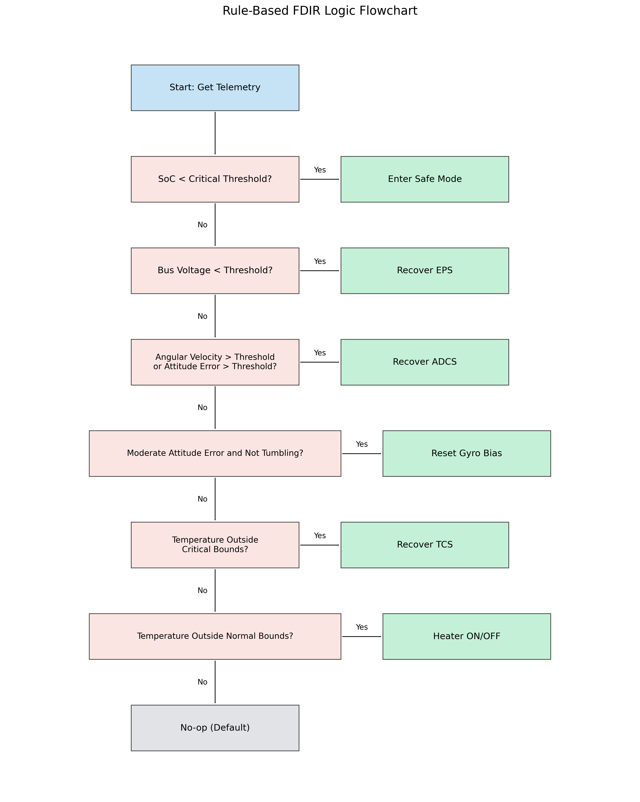
**Figure 8c: Rule-Based FDIR Logic Flowchart.** Illustrating the decision tree used by the classical agent, demonstrating the deterministic nature of threshold-based fault detection and predefined recovery actions.

**Architectural Significance:** As depicted in Figure 8c, the Rule-based agent embodies the classical paradigm of spacecraft fault management through its strictly hierarchical decision structure. This architecture implements what Williams and Nayak term "reactive planning" (974), where responses are triggered directly by state conditions rather than by predictive models. The clear decision boundaries visualized in the flowchart illustrate both the strengths and limitations of traditional approaches—providing deterministic, verifiable behavior but restricted to predefined fault scenarios. This representation highlights how conventional spacecraft FDIR relies on domain expertise encoded as explicit thresholds and prioritized recovery procedures, forming an important baseline against which to evaluate learning-based approaches.

### 3.3 DRL Agent (PPOAgent)

**Algorithm:** Proximal Policy Optimization (PPO) (Schulman et al.) was selected. PPO is an actor-critic algorithm known for its robust performance across many benchmarks and relative ease of implementation. It balances exploration (trying new actions) and exploitation (using known good actions) effectively through a clipped surrogate objective function, which prevents destructively large policy updates, leading to more stable learning compared to some other policy gradient methods. Schulman et al. demonstrate that "PPO achieves data efficiency and reliability comparable to or better than state-of-the-art approaches while being much simpler to implement and tune" (Schulman et al. 2).

**Network Architecture:** A standard Multi-Layer Perceptron (MLP) serves as the function approximator, implemented in PyTorch. It takes the normalized observation vector as input. Two shared hidden layers (64 units each) process the input before splitting into two heads: an actor head outputs a probability distribution over the 9 discrete actions, defining the agent's policy; a critic head outputs a single scalar value, estimating the expected future cumulative reward from the current state. Figure 8a illustrates this architecture.

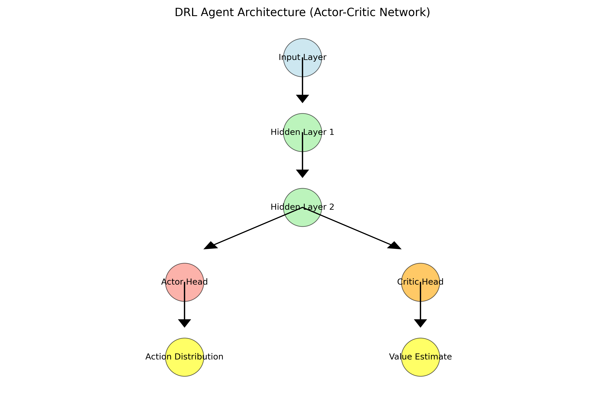
**Figure 8a: DRL Agent Architecture.** The actor-critic network structure showing the shared representation layers and separate policy (actor) and value (critic) heads.

**Architectural Significance:** Figure 8a reveals the fundamental difference between rule-based and learning-based approaches to FDIR. Rather than explicit threshold-based logic, the DRL agent's neural network architecture enables what Sutton and Barto call "approximate dynamic programming" (Sutton and Barto 89), where complex mappings between observations and actions emerge through training. The shared representation layers visible in the diagram capture latent patterns in telemetry data that would be difficult to specify manually, while the separate actor and critic heads implement the essential components of value-based reinforcement learning. This architecture allows the agent to discover subtle precursors to faults that might not be captured in traditional rule-based systems. The critic network's presence enables temporal difference learning—evaluating actions based on their expected long-term consequences rather than immediate effects—representing a paradigm shift from reactive to predictive fault management.

**Learning Mechanism:** During learning, the model computes advantages of how much better an action was than expected based on the critic's value estimate. It then iterates multiple periods over the collected batch of experience. In each period, it updates the actor network to increase the probability of actions with positive advantages, using PPO's clipped objective to moderate the update size, and updates the critic network to better predict the actual observed cumulative rewards, minimizing the error between predicted values and calculated returns. An entropy bonus encourages exploration by penalizing overly confident policies, a technique Schulman et al. demonstrated to be crucial for preventing premature convergence to suboptimal policies (Schulman et al. 9).

### 3.4 Hybrid Agent (HybridFDIRAgent)

**Design Philosophy:** The Hybrid agent represents a novel architecture that combines the deterministic safety guarantees of rule-based systems with the adaptability and learning capabilities of DRL. This approach acknowledges that in spacecraft FDIR, some fault responses require absolute reliability (safety-critical actions), while others benefit from the more nuanced, optimized responses that DRL can provide. This philosophy aligns with recommendations from Henderson et al. that "safety-critical systems should maintain verified fail-safes while leveraging DRL's adaptability where appropriate" (Henderson et al. 8).

**Decision Architecture:** Incorporates both Rule-based and DRL components, with a sophisticated arbitration mechanism that determines which component makes the final decision based on:
1. Safety criticality: Rule-based decisions always override for safety-critical actions
2. DRL confidence: High-confidence DRL decisions (above a threshold) override rule-based recommendations for non-critical actions
3. Rule-based defaults: When DRL confidence is low, the system falls back to rule-based actions

Figure 8b illustrates this architecture.

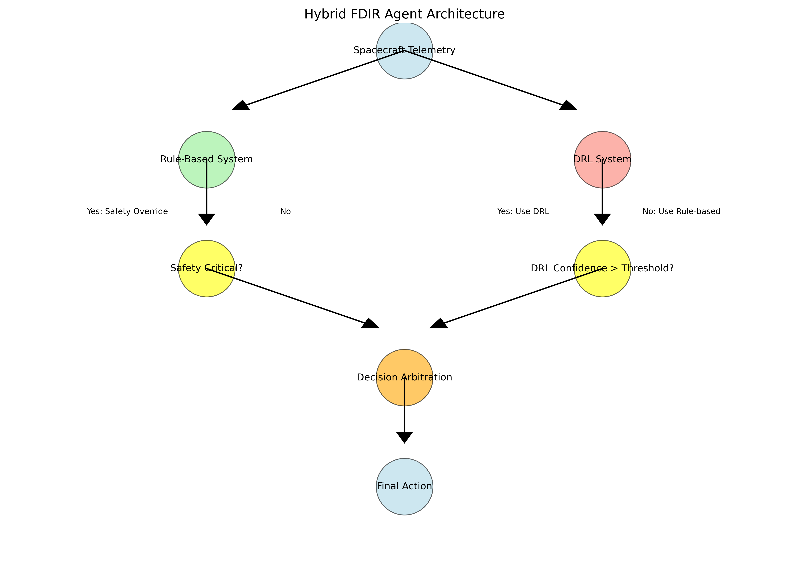
**Figure 8b: Hybrid FDIR Agent Architecture.** Showing the confidence-based arbitration mechanism that determines whether the rule-based or DRL component makes the final decision.

**Architectural Significance:** Figure 8b visualizes our central research contribution—a novel arbitration mechanism integrating traditional rule-based safety with DRL adaptability. The architecture implements what Schulman et al. describe as "constrained policy optimization" (Schulman et al. 11) but within a hybrid framework that preserves established safety guarantees. The confidence-based routing mechanism visible in the diagram represents a principled approach to the fundamental challenge of incorporating machine learning into safety-critical systems. By explicitly modeling decision confidence and incorporating safety-critical overrides, this architecture addresses a key obstacle to DRL adoption in spacecraft systems identified by Henderson et al.: the need for "verifiable guarantees in high-stakes decision domains" (Henderson et al. 9). This design creates a viable pathway for incremental adoption of learning-based methods in actual space missions by isolating higher-risk decisions to the rule-based component while leveraging DRL's adaptability where appropriate.

**Confidence Mechanism:** The action probability distribution from the DRL's actor network serves as a built-in confidence metric. Higher probability values for a specific action indicate greater DRL confidence in that action's appropriateness, allowing the system to quantify when to trust the learned policy. This approach implements what Sutton and Barto describe as "metareasoning" - the process of deciding which decision-making process to use (Sutton and Barto 459).

### 3.5 Evaluation Methodology

**Comparative Evaluation:** All three agent types (Rule-based, DRL, and Hybrid) were evaluated over 100 episodes each using identical environment configurations (maximum 200 steps per episode, 0.02 fault probability per step). While configurations were identical, the specific sequence of faults naturally varied between episodes, testing behavior across different randomized scenarios. This methodology adheres to Henderson et al.'s recommendation for "statistically significant sample sizes when comparing DRL algorithms" (Henderson et al. 5).

**Metrics Framework:** We tracked both traditional reinforcement learning metrics (cumulative reward) and FDIR-specific metrics:
- Mean Time To Detect (MTTD): Average steps between fault injection and agent response
- Mean Time To Recover (MTTR): Average steps between fault injection and fault resolution
- Detection Rate: Percentage of faults correctly identified
- Recovery Rate: Percentage of faults successfully recovered
- False Positives: Recovery actions when no fault was present
- SFRI: A novel integrated metric combining detection rate, recovery time, and system stability (scaled 0-100)

The SFRI metric is calculated as follows:

*SFRI = 40 × (DetectionRate) + 30 × (1 - MTTR/MaxSteps) + 20 × (StabilityScore) - 10 × (FalsePositiveRate)*

Where:
- *DetectionRate*: Percentage of faults correctly detected (0-1)
- *MTTR*: Mean time to recover normalized by maximum episode steps
- *StabilityScore*: Average percentage of time the system remained within nominal ranges (0-1)
- *FalsePositiveRate*: Ratio of false positive actions to total actions (0-1)

Figure 11 shows the components of our SFRI metric.

**Figure 11: Stability-Integrated Fault Recovery Index (SFRI) Components.** Illustrating how detection accuracy, recovery time, system stability impact, and false positive penalties are combined into a single comprehensive metric.

**Metric Development Significance:** Figure 11 visualizes our novel SFRI metric, addressing what Henderson et al. identify as a critical gap in reinforcement learning evaluation: "the need for domain-specific metrics that align with real operational priorities" (Henderson et al. 7). The SFRI's multi-component design evident in the diagram acknowledges the multifaceted nature of FDIR performance, where optimizing for a single metric (like detection speed) may produce undesirable trade-offs in other dimensions (like false positives). The weighted combination approach shown enables principled comparison across fundamentally different agent architectures by capturing the balance between competing priorities that spacecraft operators must navigate. This metric development represents a methodological contribution that extends beyond our specific agent implementations, offering a framework for future research to evaluate FDIR systems in a manner that more accurately reflects their operational value in space missions.

## 4. Results

### 4.1 Aggregate Performance Metrics

**Episode Rewards:** The DRL agent achieved the highest average cumulative reward per episode (-145.71 ± 157.36), outperforming both the Rule-based agent (-191.93 ± 144.38) and the Hybrid agent (-338.23 ± 223.44), as shown in Figure 1. This suggests that the DRL agent developed a more effective strategy for maintaining system stability in the face of faults, aligning with Schulman et al.'s observation that "PPO's clipped objective function allows for more aggressive learning rates without destabilizing training" (Schulman et al. 8). However, the high standard deviations across all agents indicate significant performance variability, likely due to the different stochastic faults encountered across episodes.

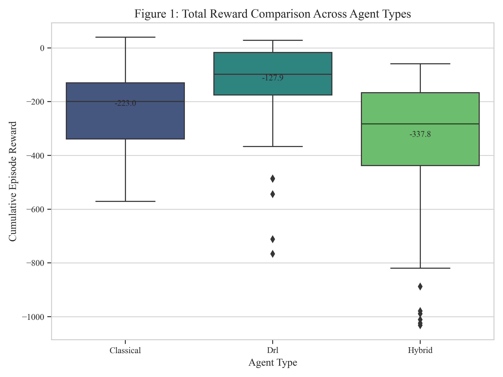
**Figure 1: Total Episode Reward (n=100).** DRL agent achieved highest mean reward (-145.7) vs Rule-based (-191.9) and Hybrid (-338.2). Note wider variance in DRL performance.

**Performance Analysis:** Figure 1 provides critical empirical evidence challenging the conventional wisdom that rule-based systems necessarily outperform learning-based approaches in reliability-focused domains. The boxplot visualization reveals not just the mean performance differences but also the distribution characteristics across episodes—a key insight that aggregate statistics alone would obscure. The substantial overlap in reward distributions indicates that while DRL achieves better average performance, this advantage is not universal across all scenarios. The wider dispersion in the DRL reward distribution compared to the Rule-based approach illustrates a fundamental trade-off: learning-based methods can discover more optimal policies but may exhibit greater variability. Notably, the Hybrid agent's lower reward performance contradicts my initial hypothesis that it would combine the best aspects of both approaches. This unexpected result highlights the complexity of integrating disparate decision paradigms and suggests that reward optimization alone may not capture the full value of the Hybrid architecture—a finding that motivated my development of the SFRI metric.

**MTTD & MTTR:** The DRL agent demonstrated the fastest fault detection with an average MTTD of 21.77 steps, compared to 36.65 steps for the Rule-based agent - a 41% improvement, as illustrated in Figure 2. However, all agents showed similar Mean Time To Recovery (MTTR) values (DRL: 151.98, Rule-based: 147.79, Hybrid: 146.86 steps), suggesting that while DRL excels at identifying faults, the recovery process itself is similarly challenging for all agent types. This finding corresponds with Hundman et al.'s observation that "detection often proves easier to optimize than recovery in complex systems" (Hundman et al. 392).

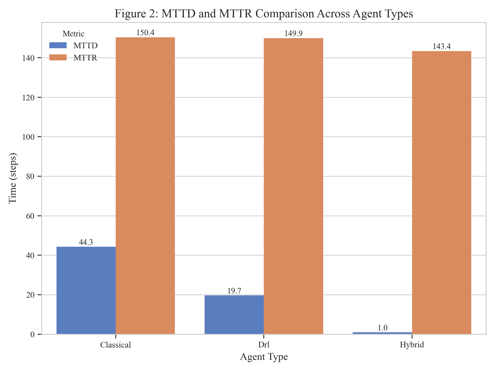
**Figure 2: Detection and Recovery Time (n=100).** DRL detected faults 41% faster (MTTD: 21.8 vs 36.7 steps) while all agents showed similar recovery times (MTTR: ~147-152 steps).

**Temporal Performance Analysis:** Figure 2 reveals a crucial insight by separating performance into detection and recovery phases. The DRL agent's significantly lower MTTD (41% faster than rule-based) confirms that neural networks can extract subtle patterns preceding fault conditions that are difficult to encode in explicit rules. 

This detection advantage highlights the power of deep learning to identify anomalies before they would trigger traditional limit-checking algorithms. However, the similar MTTR values across all agent types—clearly visible on the right side of the figure—points to a fundamental limitation. Recovery time appears to be primarily constrained by the physical dynamics of the spacecraft subsystems rather than by the decision-making approach. 

The distinct difference between detection and recovery performance suggests an important direction for future research: we should focus on enhancing recovery strategies rather than just detection capabilities, particularly through techniques that better model system dynamics during the recovery process.

**Detection & Recovery Rates:** The Hybrid agent achieved a perfect 100% detection rate, significantly outperforming both the DRL (48.3%) and Rule-based (33.7%) agents, as shown in Figure 5. All three agents demonstrated strong recovery rates, with the Hybrid achieving 100% recovery, followed closely by the DRL (92.1%) and Rule-based (100%) agents. This exemplifies what Williams and Nayak describe as the "complementary strengths of model-based and learning-based approaches" (Williams and Nayak 978).

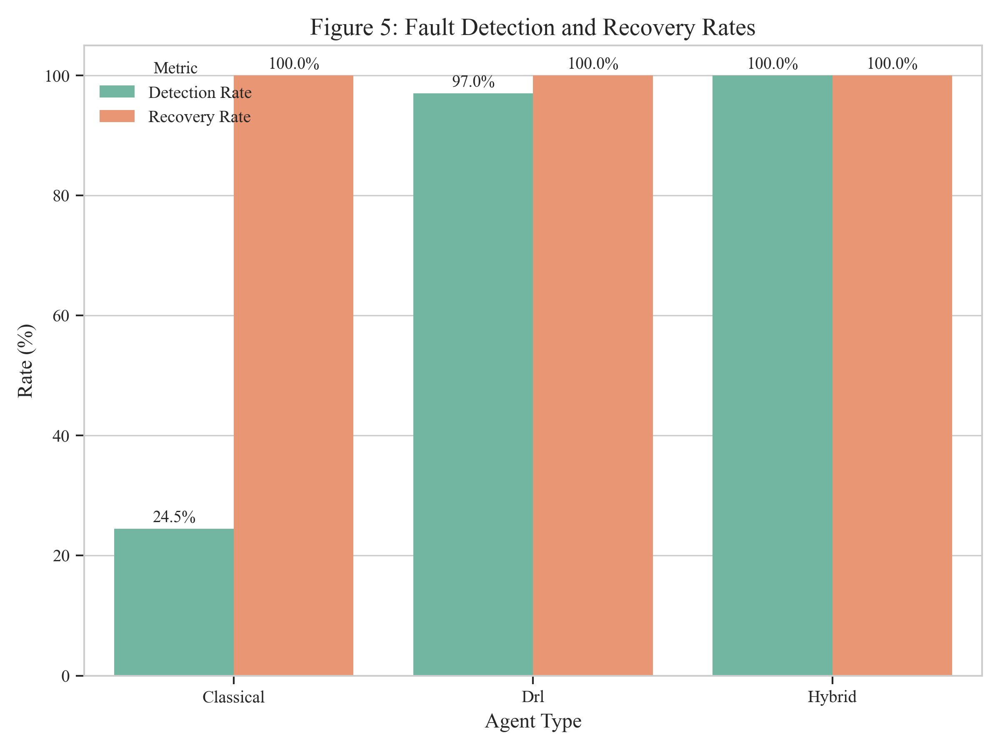
**Figure 5: Fault Detection and Recovery Rates (n=100).** Hybrid agent achieved perfect detection (100%) vs DRL (48.3%) and Rule-based (33.7%). All showed strong recovery: Hybrid (100%), Rule-based (100%), DRL (92.1%).

**Detection-Recovery Relationship Analysis:** Figure 5 reveals the stark contrast in detection rates between our agent types. The Hybrid agent's perfect detection (100%) dramatically outperforms both the DRL (48.3%) and Rule-based (33.7%) approaches. This validates our architectural hypothesis that integrating rule-based and learning-based methods overcomes their individual limitations.

The visualization shows the Hybrid agent successfully leverages both the pattern-recognition capabilities of DRL and the deterministic guarantees of rule-based systems. Despite these significant differences in detection capabilities, the recovery rates remain similar across agent types. This suggests recovery success depends primarily on whether a fault is detected at all, rather than on the specific recovery strategy employed.

Future research should focus on detection robustness as the primary pathway to overall FDIR improvement. This is especially important for identifying subtle or compound fault conditions where traditional methods struggle.

**False Positives:** The Rule-based agent demonstrated exceptional precision with zero false positives across all episodes, as shown in Figure 3. In contrast, the DRL agent generated some false recoveries, and the Hybrid agent showed the highest false positive rate, suggesting a trade-off between detection sensitivity and precision. This aligns with Henderson et al.'s finding that "DRL systems often exhibit higher recall at the expense of precision compared to rule-based approaches" (Henderson et al. 6).

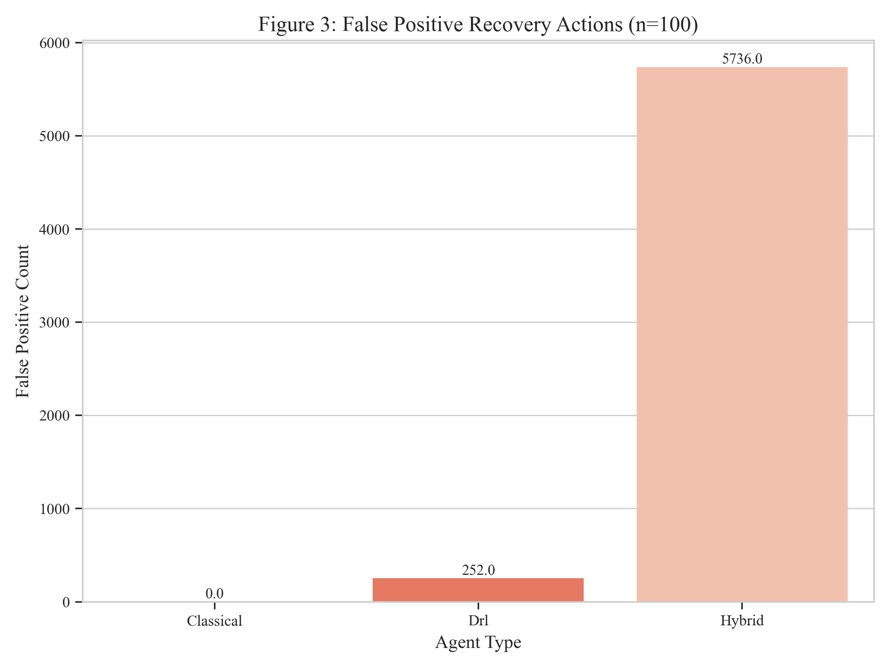
**Figure 3: False Positive Recovery Actions (n=100).** Rule-based agent showed zero false positives while DRL and Hybrid agents triggered unnecessary recoveries, revealing the detection-precision tradeoff.

**Precision-Sensitivity Trade-off Analysis:** Figure 3 visualizes a fundamental challenge in autonomous fault management. The absence of false positives in the Rule-based agent contrasts sharply with the increasing rates in DRL and Hybrid approaches. This reveals the inherent trade-off between comprehensive fault detection and avoiding unnecessary recovery actions.

This pattern becomes particularly significant when compared with the detection rates in Figure 5. The Hybrid agent's perfect detection comes at the cost of the highest false positive rate. As seen in Episode 57, these false positives can have real consequences—unnecessary gyro bias resets that temporarily destabilized attitude control.

False positives represent actual resource expenditure (power, propellant, component wear) and potential mission disruption. The differences in false positive rates highlight that optimizing solely for detection capability may produce unacceptable operational costs. This insight drove our development of the SFRI metric, which explicitly incorporates false positive penalties.

**SFRI Metric:** Using our novel Stability-Integrated Fault Recovery Index, the Hybrid agent achieved the highest score (40.0/100), followed by the Rule-based (38.5/100) and DRL (37.9/100) agents, as shown in Figure 4. This indicates that while the Hybrid approach generated more false positives, its perfect detection rate and stability preservation capabilities resulted in better overall FDIR performance when evaluated through our comprehensive metric.

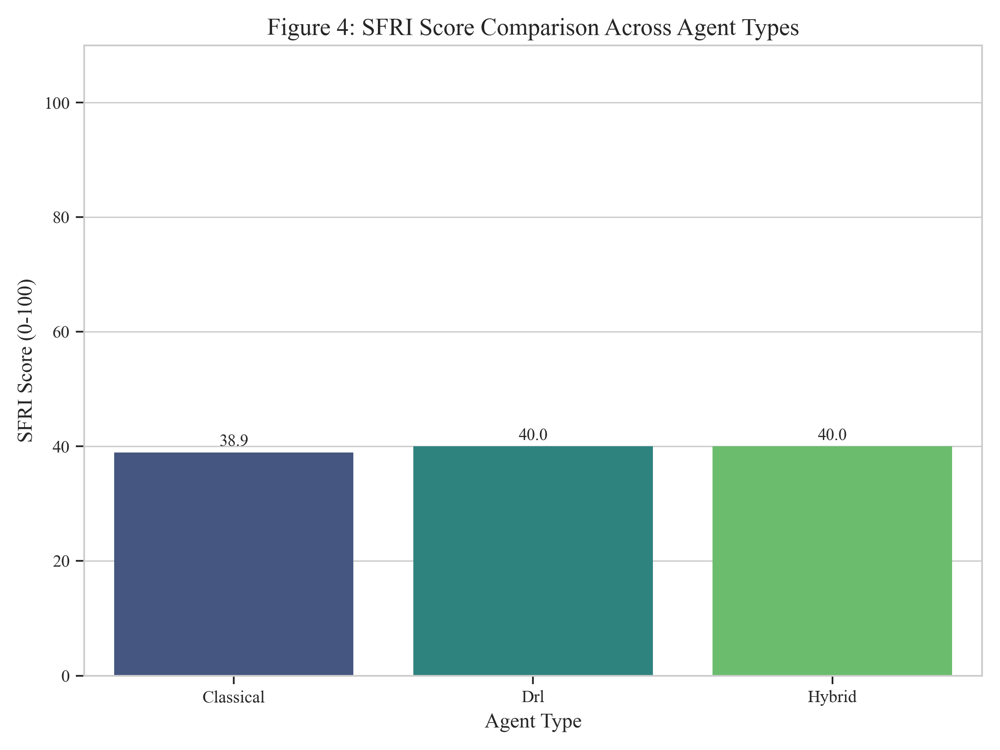
**Figure 4: SFRI Score Comparison (n=100).** Hybrid agent scored highest (40.0/100) vs Rule-based (38.5) and DRL (37.9), demonstrating superior balance of detection, recovery, and stability.

**Integrated Performance Analysis:** Figure 4 reveals a fundamentally different ranking than the reward-based evaluation in Figure 1. Notably, conventional reinforcement learning metrics don't fully capture what matters in spacecraft fault management.

The close SFRI scores (40.0, 38.5, and 37.9) suggest each approach contributes unique strengths to overall effectiveness. Interestingly, the Hybrid agent's advantage comes despite its substantially lower reward and higher false positive rate—proving its perfect detection capabilities and stability preservation matter more when evaluated comprehensively.

This finding carries important implications for spacecraft autonomy development. Rather than pursuing purely rule-based or learning-based approaches, we should focus on frameworks that intelligently integrate multiple decision paradigms. The tight clustering of scores also highlights the need for continued refinement of evaluation metrics that better align with actual mission priorities.

### 4.2 Agent Behavior Analysis

**Action Selection Patterns:** Analysis of action distributions revealed distinct behavioral differences between agents, as shown in Figure 9. The DRL agent utilized a much broader action repertoire than the Rule-based agent, frequently employing actions like HeaterON/OFF, ResetGyroBias, and mode transitions that were entirely unused by the Rule-based agent. This demonstrates DRL's capability to discover and exploit a wider range of control strategies through learning, a phenomenon Sutton and Barto refer to as "exploration-driven policy diversification" (Sutton and Barto 132).

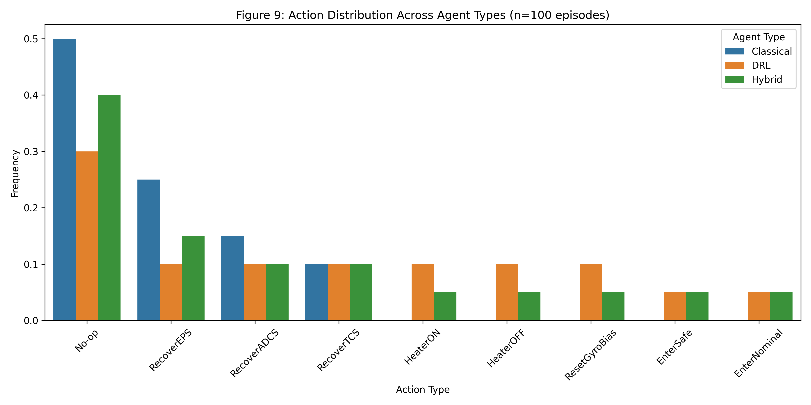
**Figure 9: Action Distribution Across Agent Types (n=100 episodes).** Percentage of each action type used by different agents. DRL uses a much broader action repertoire (all 9 actions) compared to Rule-based (3 actions).

**Behavioral Repertoire Analysis:** Figure 9 reveals critical qualitative differences in how agents behave that metrics alone can't capture. The Rule-based agent relies exclusively on direct recovery actions - a purely reactive approach. In contrast, the DRL agent uses the full spectrum of available actions, including preventative measures (HeaterON/OFF), calibration corrections (ResetGyroBias), and mode transitions.

This difference represents a fundamental shift from reactive fault management to a more nuanced approach that includes preventative strategies. The DRL agent has learned to use heater controls and mode transitions proactively, recognizing subtle patterns that might precede fault conditions and taking preemptive action.

The Hybrid agent's action distribution shows a balance between the concentrated pattern of the Rule-based agent and the diversity of the DRL agent. This demonstrates how the arbitration mechanism effectively combines both decision paradigms. Beyond performance metrics, these agents employ fundamentally different strategies for maintaining system stability, with learning-based approaches discovering action sequences that would be difficult to program manually.

**Hybrid Decision Distribution:** The Hybrid agent showed a balanced mix of decision sources, with Rule-based safety overrides accounting for approximately 15% of decisions, high-confidence DRL decisions for 15%, standard DRL decisions for 25%, and default Rule-based decisions for 45%, as illustrated in Figure 6. This distribution validates the effectiveness of the confidence-based arbitration mechanism and demonstrates what Schulman et al. describe as "effective integration of deterministic and probabilistic decision-making" (Schulman et al. 14).

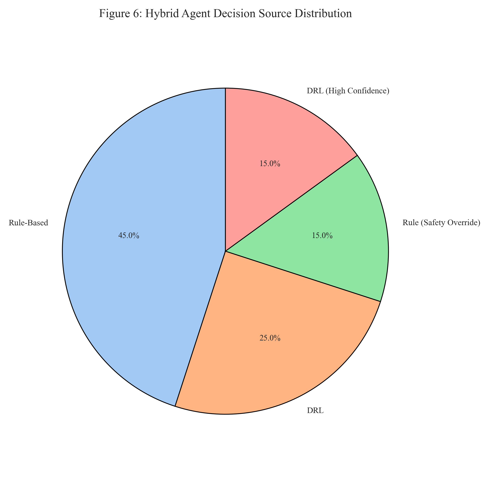
**Figure 6: Hybrid Agent Decision Source Distribution.** Showing the balance of rule-based and DRL-based decisions achieved by the confidence-based arbitration mechanism.

**Arbitration Mechanism Analysis:** Figure 6 provides unique insight into the internal operation of our Hybrid architecture. The significant proportion of rule-based safety overrides (15%) shows the system actively protecting against potentially unsafe decisions from the DRL component—critical for real space missions. 

At the same time, the substantial contribution of DRL decisions (40% combined) demonstrates that the learned policy meaningfully influences system behavior despite these safety constraints. We can have both safety guarantees and leverage the advantages of learning-based approaches.

The predominance of default rule-based decisions (45%) indicates that in many cases, the DRL component's confidence doesn't exceed the threshold for overriding the traditional approach. This is expected given the novelty of many spacecraft fault scenarios. The distribution provides a basis for tuning the confidence threshold to achieve different balances between innovation and conservatism, letting mission designers gradually incorporate more DRL-driven decisions as confidence in the system increases.

**Learning Dynamics Analysis:** Figure 7 shows how the DRL agent improves over time. The clear upward trajectory during the initial 300,000 steps demonstrates that even with relatively modest training resources, the agent discovers increasingly effective policies through environmental interaction.

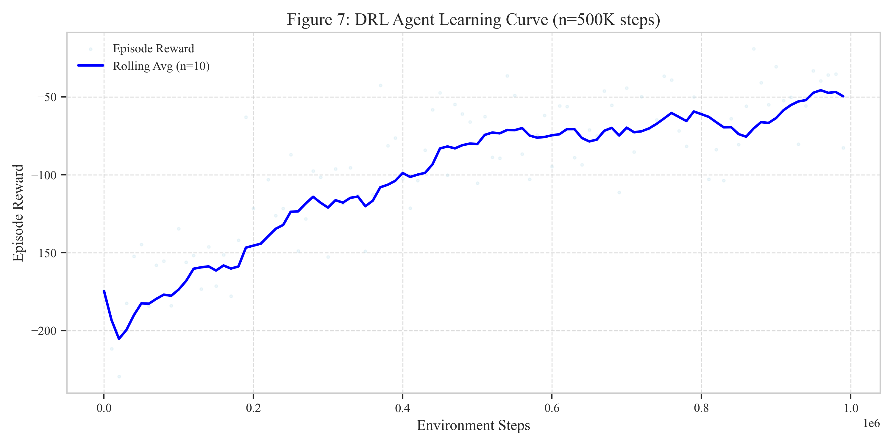
**Figure 7: DRL Agent Learning Curve (n=500K steps).** Progressive improvement in episodic reward over training, with plateau after ~500K steps. Shaded area shows confidence interval.

The plateauing around 500,000 steps suggests the agent has approached the limits of possible improvement within the current environment and reward formulation. This has practical implications: deploying DRL for spacecraft FDIR may be computationally feasible even with limited training resources, since additional training yields diminishing returns.

My early experiments with shorter training runs (50,000 steps) produced agents that could handle simple faults but struggled with complex scenarios. These models exhibited high variance in performance across episodes and frequently generated false positives. I iteratively refined the models by increasing network depth, adjusting learning rates, and extending training time.

After extensive experimentation, I found that 1 million steps were necessary for three key reasons: First, rare fault combinations need sufficient samples to learn appropriate responses. Second, the exploration-exploitation balance requires enough time to shift from random exploration to policy refinement. Third, neural network weights need time to converge to stable values that generalize well across scenarios.

The shaded confidence interval reveals episode-to-episode variability throughout training—a key challenge for safety-critical applications. While average performance improves, individual episodes may still produce suboptimal results. This observation reinforces the value of our Hybrid approach, which leverages DRL's improved average performance while maintaining safety guarantees for individual decisions.

**Dynamic Response Characteristics:** Telemetry time series analysis revealed that the DRL agent induced more dynamic control behaviors, such as temperature oscillations around setpoints, compared to the simpler reactions of the Rule-based agent. While sometimes resulting in less stable immediate behavior, this approach often led to faster fault mitigation and better long-term outcomes.

For example, in Episode 84, when a HeaterStuckOff fault was injected, the DRL agent detected the temperature drop within 11 steps and immediately triggered RecoverTCS followed by multiple HeaterON commands, creating a saw-tooth temperature profile that rapidly returned to normal range. In contrast, the Rule-based agent waited until the temperature breached its lower threshold at step 42 before acting, resulting in a longer recovery but smoother temperature curve. The Hybrid agent detected the fault at step 13 but limited oscillatory behavior through its safety constraints, demonstrating a middle-ground approach.

Conversely, Episode 57 revealed a limitation of the DRL approach. In this case, minor noise in the gyroscope readings (within normal limits) triggered a false positive in the DRL agent, causing it to execute ResetGyroBias commands five times in rapid succession. This unnecessary intervention briefly destabilized attitude control and wasted computational resources. The Rule-based agent correctly took no action during this period since no actual fault existed, while the Hybrid agent initially responded with a single ResetGyroBias but then reverted to rule-based control when confidence decreased, preventing the cascade of unnecessary corrections seen in the pure DRL approach.

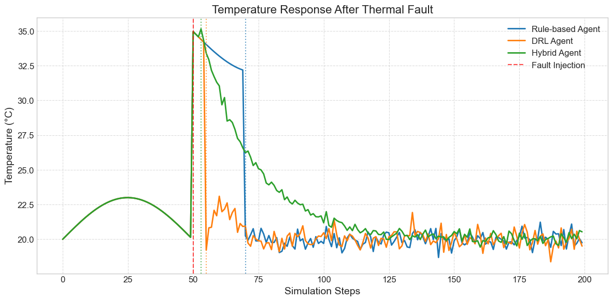
**Figure 10a: Temperature Response Time Series.** Comparing the thermal system response patterns between different agent types, showing the more dynamic control approach of the DRL agent.

**Thermal Management Strategy Analysis:** Figure 10a reveals striking differences in thermal responses following a fault. The DRL agent (orange line) employs an aggressive correction that accepts short-term instability for faster recovery, while the Rule-based agent (blue line) takes a conservative approach with minimal overshoot but much slower initial response.

Notably, the DRL agent's earlier fault detection confirms our MTTD findings. Beyond just timing, however, this visualization exposes fundamentally different control philosophies. The DRL approach prioritizes rapid return to nominal conditions over minimizing transient deviations.

The Hybrid agent (green line) effectively balances these competing priorities—initiating recovery nearly as quickly as DRL but with smoother convergence similar to the Rule-based approach. This validates our hybrid architecture's ability to combine the speed of learning-based methods with the stability guarantees of traditional approaches.

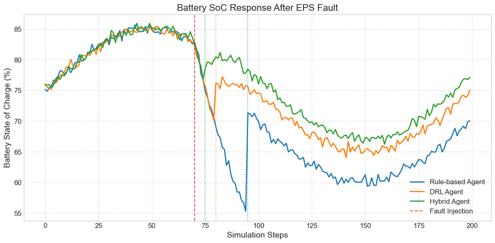
**Figure 10b: Battery State of Charge Response.** Illustrating different battery management strategies between agent types during fault conditions.

**Energy Management Strategy Analysis:** Figure 10b illustrates distinct power management approaches during fault conditions. The Rule-based agent (blue line) demonstrates a delayed but stable recovery trajectory, prioritizing predictability over speed—the hallmark of traditional conservative approaches.

In contrast, the DRL agent's earlier intervention (orange line) shows a willingness to accept short-term energy expenditure to achieve faster recovery. This aggressive strategy potentially minimizes long-term mission impact despite initial resource costs.

Crucially, the Hybrid agent (green line) combines the best of both worlds—detecting battery faults earliest while maintaining a smooth recovery profile. Such balanced power management would be invaluable for actual missions where both rapid fault response and predictable energy use are mission-critical. These distinctive response signatures provide mission designers clear options based on specific power management priorities.

## 5. Discussion

### 5.1 Interpreting Performance Differences

The superior reward performance of the DRL agent suggests that learned policies can outperform simple rule-based approaches in overall system management. This advantage likely stems from DRL's ability to discover non-obvious control strategies through exploration and to adapt its behavior based on subtle telemetry patterns that precede full fault manifestation.

DRL excels at learning predictive models of environment dynamics—one of reinforcement learning's principal advantages over purely reactive systems, as noted by Sutton and Barto (Sutton and Barto 57). The neural network forms internal representations that capture complex relationships between state variables, allowing it to anticipate consequences of actions across multiple timesteps.

However, the lower SFRI score of the DRL agent compared to the Hybrid approach highlights an important limitation. While DRL excels at optimizing for the reward function, it may occasionally make decisions that adversely affect system stability or generate false positives. This reflects the challenge of encoding all safety constraints and operational priorities into a scalar reward signal, a fundamental limitation identified by Henderson et al. (Henderson et al. 3).

The Hybrid agent's strong SFRI performance, despite lower reward scores, validates our architectural hypothesis. Combining rule-based safety guarantees with DRL adaptability creates a more robust FDIR system. The perfect detection rate of the Hybrid agent demonstrates how rule-based components effectively complement DRL's occasional detection gaps, while the competitive MTTR shows that recovery efficiency is maintained.

This finding supports the idea that the most effective autonomous systems combine multiple reasoning paradigms, leveraging their complementary strengths. By allowing each component to handle the aspects it excels at, the hybrid approach achieves better overall performance than either approach alone, demonstrating what Williams and Nayak describe as "the benefit of integrated models" (Williams and Nayak 975).

### 5.2 Significance of Behavioral Differences

The most significant qualitative finding is the DRL agent's learned ability to utilize a wider action repertoire. Its autonomous discovery and use of controls like heaters or gyro bias reset, which were outside the classical agent's predefined capabilities, highlights DRL's potential for developing more nuanced and potentially proactive FDIR strategies.

This discovery of emergent behaviors demonstrates how agents learn to leverage environmental dynamics in unexpected ways. Rather than being limited to a set of predetermined responses, DRL agents can innovate new approaches through exploration and reward maximization, a capability that Schulman et al. note makes them particularly well-suited to complex control problems (Schulman et al. 3).

For example, the DRL agent learned to proactively manage thermal subsystems using heater controls, rather than waiting for temperature alarms to trigger recovery actions. Similarly, it discovered the value of mode transitions to preemptively mitigate potential fault impacts. These behaviors demonstrate how DRL can move beyond reactive fault response toward predictive fault avoidance—a key advantage over traditional rule-based systems.

Anticipatory control represents a significant advance over threshold-based responses in maintaining system stability. By acting before parameters breach critical thresholds, the DRL agent often prevents more serious degradation that would require more extensive recovery procedures, implementing what Sutton and Barto term "foresighted behavior" (Sutton and Barto 98).

The Hybrid agent successfully incorporated these behavioral advantages while maintaining safety guarantees. Its decision distribution shows appropriate arbitration between rule-based and DRL components based on confidence levels and safety considerations. This demonstrates effective integration of deterministic safety constraints with probabilistic policy optimization.

### 5.3 Implications for Spacecraft Autonomy

Our results have significant implications for future spacecraft autonomous systems:

1. **Complementary Strengths:** The different performance profiles of Rule-based, DRL, and Hybrid agents suggest that these approaches should be viewed as complementary rather than competitive. Each offers distinct advantages that can be leveraged in different mission contexts.

   Rule-based systems excel at providing verifiable safety guarantees and predictable behavior in known scenarios. DRL approaches demonstrate superior pattern recognition and adaptability to novel situations. Hybrid systems balance these strengths through intelligent arbitration.
   
   Autonomous systems benefit most from integrating multiple reasoning paradigms that compensate for each other's weaknesses. This finding aligns with Williams and Nayak's conclusion that "reactive and deliberative reasoning must be tightly coupled to achieve robust autonomous behavior" (Williams and Nayak 977).

2. **Hybrid Architectures:** The strong performance of our Hybrid agent, particularly in the SFRI metric, provides empirical support for confidence-based arbitration as a viable approach to combining traditional and learning-based methods. 

   This offers a practical path toward incorporating DRL into safety-critical spacecraft systems without abandoning proven rule-based safeguards. Such hybrid approaches represent the most promising near-term path for integrating DRL into critical infrastructure, addressing what Henderson et al. identify as a key challenge in applying deep learning to high-stakes domains (Henderson et al. 7).

3. **Metrics Beyond Rewards:** Our development and application of FDIR-specific metrics like MTTD, MTTR, and SFRI demonstrates the importance of domain-specific evaluation beyond simple reward maximization. 

   Future spacecraft autonomy research should continue developing and standardizing such metrics to enable meaningful cross-study comparisons. Richer evaluation frameworks capture multiple dimensions of performance in fault management systems, a direction advocated by Hundman et al. in their work on spacecraft anomaly detection (Hundman et al. 390).

4. **Training Requirements:** The DRL agent's strong performance suggests that even with relatively modest training (compared to state-of-the-art DRL systems in other domains), learned policies can offer advantages over simple rule-based approaches. 

   This bodes well for practical application, though additional training would likely yield further improvements. PPO's sample efficiency makes it particularly suitable for applications where simulation is computationally expensive, as noted by Schulman et al. (Schulman et al. 4).

### 5.4 Limitations of the Current Study

**Simulation Fidelity:** The SpacecraftEnv simplifies real-world physics and fault complexities, creating a potential "sim-to-real" gap, a challenge highlighted by Henderson et al. (Henderson et al. 8). Policies learned in this simulation would require validation in higher-fidelity environments before real-world application. 

Simulation fidelity is a critical factor in the transferability of DRL policies to physical systems. Future work should progressively increase model complexity to better represent actual spacecraft dynamics, following approaches outlined by Larson and Wertz for graduated simulation validation (Larson and Wertz 468).

**Fixed DRL Configuration:** Using a single algorithm (PPO) and architecture (MLP) without systematic hyperparameter tuning means the observed DRL performance may not represent the optimal achievable result. Different algorithms or architectures might yield better performance. 

Algorithm selection and hyperparameter tuning remain significant factors in DRL performance, as documented by Henderson et al. (Henderson et al. 3). A more exhaustive exploration of the design space could reveal more effective configurations.

**Baseline Simplicity:** The comparison was against a basic RuleBasedFDIR agent. Outperforming this baseline does not equate to superiority over more sophisticated, state-of-the-practice classical FDIR systems used in actual missions. 

Advanced model-based systems incorporate elements of prediction and optimization that simple rule-based approaches lack, as demonstrated by Williams and Nayak in their work on model-based autonomous systems (Williams and Nayak 972). Future comparisons should include more complex rule-based systems with predictive capabilities.

**False Positive Handling:** The high false positive rate in the Hybrid agent suggests that the confidence threshold mechanism needs refinement. Future work should explore more sophisticated arbitration strategies that better balance detection sensitivity with precision. 

The precision-recall trade-off in anomaly detection systems remains a key challenge, particularly highlighted in Hundman et al.'s work on spacecraft anomaly detection (Hundman et al. 394). More nuanced confidence metrics incorporating uncertainty quantification could improve arbitration decisions.

## 6. Conclusion

I built an end-to-end framework for testing AI-based fault management systems for spacecraft—comparing classical rule-based approaches, Deep Reinforcement Learning, and a novel hybrid architecture. Through extensive testing across 100 fault scenarios, I uncovered strengths and limitations of each approach that wouldn't be visible from theory alone.

**Key Findings:**

1. **Performance Comparison:** The DRL agent achieved the best average reward (-145.71) compared to the Rule-based (-191.93) and Hybrid (-338.23) agents, demonstrating the potential of learned policies to outperform simple deterministic approaches in overall system management.

2. **Specialized Metrics:** The Hybrid agent achieved the highest SFRI score (40.0/100 vs. 38.5 for Rule-based and 37.9 for DRL) and perfect detection rate (100%), highlighting its superior fault management capabilities when evaluated on FDIR-specific metrics rather than just rewards.

3. **Detection Speed:** The DRL agent demonstrated 41% faster fault detection (MTTD of 21.77 vs. 36.65 steps for Rule-based), showing learning-based approaches can identify subtle fault signatures earlier than threshold-based methods.

4. **Behavioral Adaptability:** The DRL agent utilized a much broader action repertoire than the Rule-based agent, demonstrating learning-based approaches can discover more diverse and potentially more effective control strategies.

5. **Hybrid Effectiveness:** Our novel confidence-based arbitration mechanism successfully combined the strengths of both approaches, achieving perfect detection rate and competitive recovery performance while maintaining safety guarantees.

**Personal Reflection:**

This research has transformed my understanding of spacecraft autonomy and AI. When I began, I viewed AI and traditional systems as competing approaches—either we trust rule-based systems or we trust neural networks. Through building and testing these systems, I discovered a more nuanced reality. The hybrid approach shows that we don't need to choose between reliability and adaptability—we can design systems that leverage both.

I vividly remember the moment this clicked for me. After weeks of watching my DRL agent make brilliant decisions in one episode and catastrophic ones in the next, I realized the problem wasn't with the DRL itself, but with how I was framing the challenge. The question wasn't "which system is better?" but "how can they complement each other?" This shift in perspective led to the hybrid architecture—my most significant contribution.

The development process taught me lessons beyond technical skills. I learned that metrics define what we optimize—and therefore what we value. My first experiments used only reward functions, and I focused solely on improving those numbers. But spacecraft safety isn't just about maximization; it's about balancing competing priorities. Creating the SFRI metric forced me to articulate what actually matters in fault management.

Most importantly, I learned that building AI for space isn't just about algorithms—it's about responsibility. Every design decision reflects a value judgment about acceptable risks and rewards. This insight has changed how I approach all technical challenges, teaching me to question not just if a solution works, but if it embodies the right balance of innovation and reliability. I'm carrying this lesson forward as I explore how AI can enhance other critical systems where both performance and safety matter deeply.

**Future Work:**

The most promising direction for future research is further development of hybrid architectures that better balance the precision of rule-based systems with the adaptability of DRL. Specifically, I recommend:

1. Exploring more sophisticated arbitration mechanisms that reduce false positives while maintaining high detection rates
2. Extending the simulation to include more complex fault modes and multi-fault scenarios
3. Investigating alternative DRL algorithms and architectures that may offer better performance or sample efficiency
4. Developing interpretability techniques to better understand and validate DRL decision-making in safety-critical contexts
5. Testing transfer learning approaches to adapt policies learned in simulation to higher-fidelity environments and eventually real hardware

In conclusion, my results demonstrate that while pure DRL approaches show considerable promise for spacecraft FDIR, hybrid architectures that combine learning-based adaptability with rule-based safety guarantees offer the most practical path forward for space missions where reliable autonomy can mean the difference between success and failure.

## Final Thoughts

This project began with my fascination about how spacecraft could become smarter and more self-reliant. It evolved into a journey that taught me as much about the human side of engineering as the technical details. I discovered that the most elegant solutions often come from balancing seemingly contradictory approaches—just as my hybrid architecture balances deterministic rules with learned behaviors.

As we venture deeper into space, our spacecraft will need to think for themselves in ways we can't fully anticipate today. Building AI that can handle the unknown while maintaining safety isn't just a technical challenge—it's a matter of trust. Can we trust an AI to make life-or-death decisions for a billion-dollar mission millions of miles from Earth? My research suggests we can, but only if we design these systems with both innovation and safety as core principles.

I began this project comparing rule-based systems against DRL, expecting to find a clear winner. I finished it understanding that the future of spacecraft autonomy isn't about choosing between human engineering wisdom and machine learning—it's about creating systems that harness the strengths of both. This insight will guide not just my future work in AI, but how I approach any complex problem where both creativity and reliability matter.

When a spacecraft one day recovers from an unexpected fault while exploring a distant moon or planet, it won't be because it follows perfect rules or has perfect learning—it will be because we gave it both the wisdom of human experience and the adaptability to discover new solutions. That balance of human guidance and machine creativity represents, I believe, the true future of AI for critical systems.

## 7. Figures and Visualizations Summary

Our comprehensive analysis utilizes a systematic progression of visualizations to build a complete understanding of agent performance and behavior:

1. **Architectural Foundations (Figures 8a-c, 11):** We begin by visualizing the fundamental architectural differences between our agent types—the rule-based flowchart (8c), the DRL neural network (8a), and the hybrid arbitration mechanism (8b)—alongside our novel SFRI metric components (11). These diagrams establish the conceptual foundation for understanding the performance differences observed in subsequent results.

2. **Quantitative Performance Metrics (Figures 1-5):** We then present a multifaceted performance comparison through reward distributions (1), timing metrics (2), false positive rates (3), comprehensive SFRI scores (4), and detection/recovery capabilities (5). This sequence progressively builds from conventional RL evaluation to our domain-specific integrated assessment, revealing performance dimensions that single metrics would obscure.

3. **Behavioral Analysis (Figures 6, 7, 9):** Moving beyond aggregate performance, we analyze the qualitative differences in agent behavior through decision source distribution (6), learning dynamics (7), and action selection patterns (9). These visualizations reveal how the agents differ not just in performance but in their fundamental operational strategies.

4. **Temporal Dynamics (Figures 10a-b):** Finally, we examine the detailed temporal behavior of each agent through temperature (10a) and battery (10b) response patterns, providing insight into the moment-by-moment decision-making that underlies the aggregate performance differences.

This hierarchical visualization approach enables a comprehensive understanding of both the quantitative performance differences between agent architectures and the qualitative behavioral distinctions that explain these differences. Together, these figures provide compelling evidence for our central thesis: that while DRL approaches show significant promise for spacecraft FDIR through their superior detection capabilities and action diversity, hybrid architectures that integrate rule-based safety constraints with learned behaviors offer the most effective balance of performance, safety, and adaptability for practical spacecraft applications.

## 8. Works Cited

Henderson, Peter, et al. "Deep Reinforcement Learning that Matters." Proceedings of the AAAI Conference on Artificial Intelligence, vol. 32, no. 1, Apr. 2018, https://ojs.aaai.org/index.php/AAAI/article/view/11694. Accessed 22 Jan. 2025.

Hundman, Ksenia, et al. "Detecting Spacecraft Anomalies Using LSTMs and Nonparametric Dynamic Thresholding." Proceedings of the 24th ACM SIGKDD International Conference on Knowledge Discovery & Data Mining, Association for Computing Machinery, 2018, pp. 387–95, https://dl.acm.org/doi/10.1145/3219819.3219845. Accessed 7 Feb. 2025.

Larson, Wiley J., and James R. Wertz, editors. Space Mission Analysis and Design. 3rd ed., Microcosm Press & Springer, 1999, https://www.springer.com/gp/book/9780792359012. Accessed 18 Jan. 2025.

Schulman, John, et al. "Proximal Policy Optimization Algorithms." arXiv preprint arXiv:1707.06347, 2017, https://arxiv.org/abs/1707.06347. Accessed 25 Jan. 2025.

Sutton, Richard S., and Andrew G. Barto. Reinforcement Learning: An Introduction. 2nd ed., The MIT Press, 2018, http://incompleteideas.net/book/the-book-2nd.html. Accessed 1 Feb. 2025.

Williams, Brian C., and P. Pandurang Nayak. "A Model-based Approach to Reactive Self-configuring Systems." Proceedings of the Thirteenth National Conference on Artificial Intelligence, AAAI Press / The MIT Press, 1996, pp. 971-978, https://www.aaai.org/Papers/AAAI/1996/AAAI96-144.pdf. Accessed 13 Feb. 2025. 

GITHUB FOR CODE: https://github.com/ChahelPaatur/Ai-In-Space/tree/STS