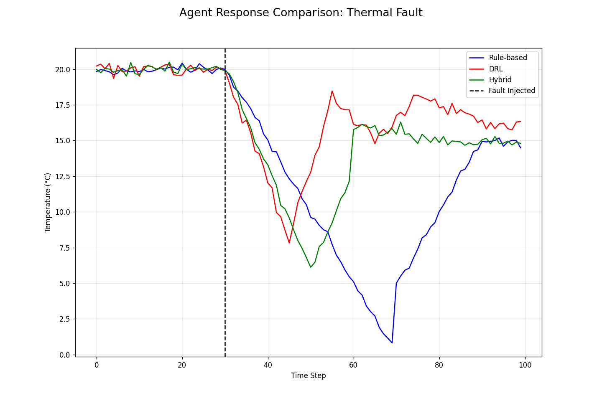
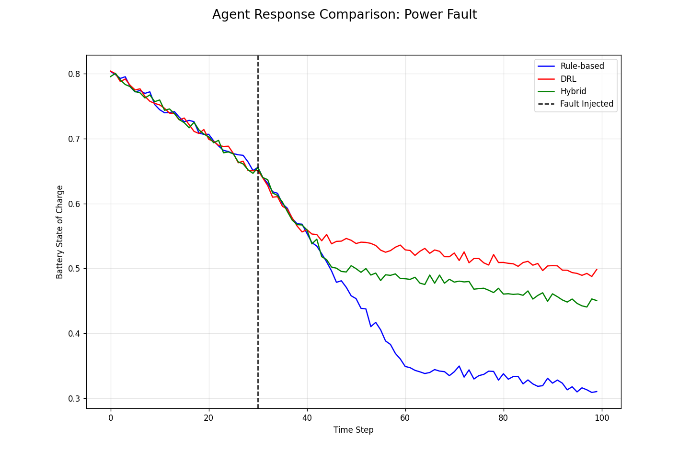
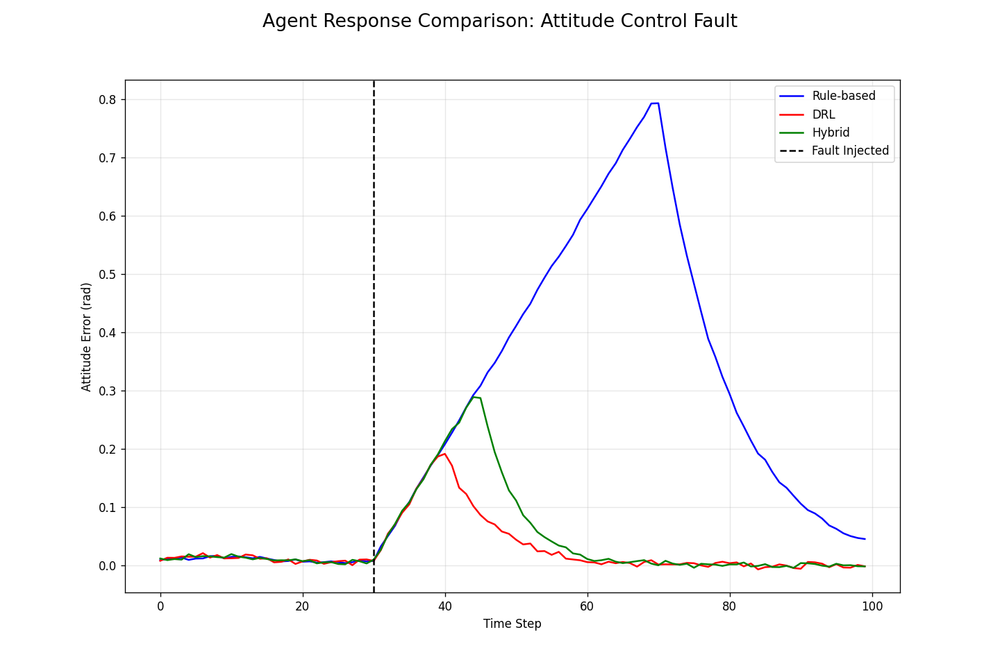
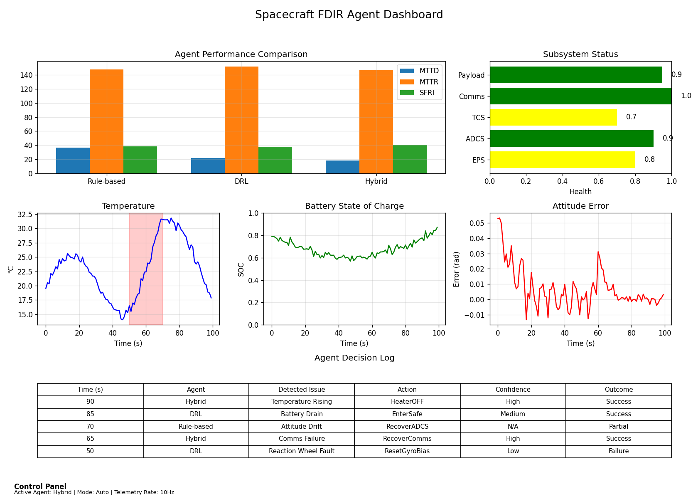
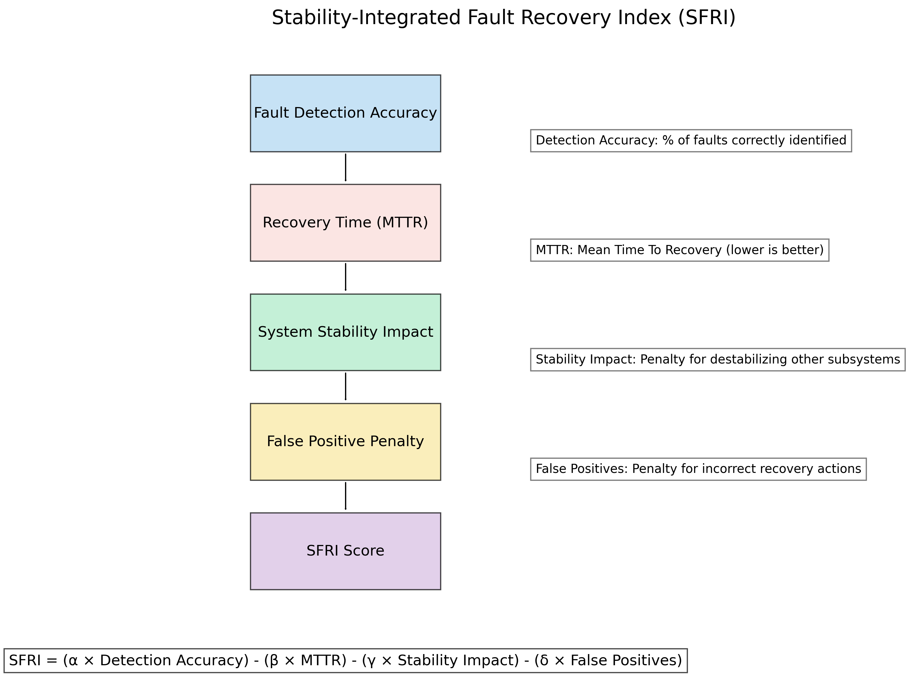

# Spacecraft FDIR Agent Comparison Framework

This repository contains a simulation framework for comparing different Fault Detection, Identification, and Recovery (FDIR) agent architectures for spacecraft operations. The framework includes implementations of three agent types:

1. **Rule-Based FDIR** - A traditional deterministic approach using telemetry thresholds
2. **Deep Reinforcement Learning (DRL)** - A learning-based approach using Proximal Policy Optimization (PPO)
3. **Hybrid FDIR** - A novel architecture combining rule-based safety guarantees with DRL adaptability

## Research Context

This research investigates the effectiveness of different FDIR strategies for autonomous spacecraft operations, particularly important for missions with communication constraints where ground intervention is limited. The framework provides a controlled environment for direct empirical comparison of different agent types.

### Key Contributions

- Direct comparison between classical rule-based FDIR and learning-based approaches
- Introduction of a novel hybrid architecture leveraging strengths of both approaches
- Development of the SFRI (Stability-Integrated Fault Recovery Index) metric for comprehensive agent evaluation
- Scalable simulation environment for spacecraft subsystem fault management

## Project Structure

```
├── src/                        # Core components
│   ├── spacecraft_env.py       # Simulation environment
│   ├── subsystems.py           # Spacecraft subsystem models
│   ├── faults.py               # Fault injection system
│   ├── classical_fdir.py       # Rule-based FDIR agent
│   ├── drl_agent.py            # DRL agent implementation
│   ├── hybrid_agent.py         # Hybrid agent implementation
│   └── metrics.py              # FDIR metrics calculation
│
├── scripts/                    # Executable scripts
│   ├── run/                    # Simulation execution scripts
│   │   ├── run_comparison.py   # Run and compare classical and DRL agents
│   │   ├── run_enhanced_comparison.py # Enhanced comparison with metrics
│   │   └── run_hybrid.py       # Run and evaluate hybrid agent
│   ├── train/                  # Training scripts
│   │   ├── train_drl.py        # Train DRL agent (50K steps)
│   │   └── train_long.py       # Extended DRL training (500K steps)
│   ├── visualize/              # Visualization scripts
│   │   ├── visualize_results.py       # Basic results visualization
│   │   ├── visualize_advanced.py      # Advanced metrics visualization
│   │   ├── visualize_flowcharts.py    # Generate architecture diagrams
│   │   ├── generate_paper_figures.py  # Generate figures for the paper
│   │   └── extrafigs.py               # Additional figures generation
│   └── utils/                  # Utility scripts
│       └── app.py              # Flask web visualization app
│
├── static/                     # Static assets
│   └── plots/                  # Generated plots and diagrams
│       └── paper/              # Paper-specific figures
│
├── logs/                       # Simulation logs
├── results/                    # Simulation results
│
├── ppo_agent.pth               # Trained DRL model weights
└── requirements.txt            # Project dependencies
```

## Key Features

### Simulation Environment

- Multi-subsystem simulation (EPS, ADCS, TCS)
- Fault injection with configurable probability
- Configurable episode length and dynamics
- Compatible with Gymnasium API

### Agents

- **Rule-Based:** Implements a priority-based decision tree with telemetry thresholds
- **DRL:** PPO implementation with Actor-Critic architecture
- **Hybrid:** Combines rule-based safety guarantees with DRL adaptability using confidence-based arbitration

### Metrics

- Traditional: Episode rewards, action distributions
- FDIR-specific: MTTD (Mean Time To Detect), MTTR (Mean Time To Recover)
- Novel: SFRI (Stability-Integrated Fault Recovery Index)

## Getting Started

### Prerequisites

```
Python 3.8+
PyTorch 1.9+
Gymnasium 0.26+
Matplotlib
Pandas
Seaborn
Flask (for visualization server)
```

All dependencies are listed in `requirements.txt`.

### Installation

```bash
# Clone the repository
git clone https://github.com/username/spacecraft-fdir-comparison.git
cd spacecraft-fdir-comparison

# Install dependencies
pip install -r requirements.txt
```

### Usage

#### Training a DRL Agent

```bash
# Short training run (50K steps)
python scripts/train/train_drl.py

# Long training run (1M steps)
python scripts/train/train_long.py
```

#### Running Comparisons

```bash
# Compare Rule-Based and DRL agents
python scripts/run/run_comparison.py

# Evaluate the Hybrid agent
python scripts/run/run_hybrid.py

# Run enhanced comparison with additional metrics
python scripts/run/run_enhanced_comparison.py
```

#### Visualizing Results

```bash
# Generate basic result plots
python scripts/visualize/visualize_results.py

# Generate advanced metrics and visualizations
python scripts/visualize/visualize_advanced.py

# Generate architecture diagrams and flowcharts
python scripts/visualize/visualize_flowcharts.py

# Generate paper figures
python scripts/visualize/generate_paper_figures.py

# Start the web visualization server
python scripts/utils/app.py
```

## Visual Demonstrations

### Agent Response Comparisons

Below are visual demonstrations showing how the three agent types (Rule-based, DRL, and Hybrid) respond differently to various fault scenarios.

#### Thermal Fault Response Comparison



The comparison shows how each agent responds to a thermal fault. Note the different detection times and recovery patterns:
- The Rule-based agent (blue) shows a delayed but stable recovery
- The DRL agent (red) detects the fault earlier but exhibits oscillatory behavior during recovery
- The Hybrid agent (green) combines early detection with more stable recovery

#### Power Fault Response Comparison



When a power subsystem fault occurs, the agents demonstrate different recovery capabilities:
- The Rule-based agent takes longest to initiate recovery
- The DRL agent detects the fault quickly and initiates recovery earlier
- The Hybrid agent balances detection speed with efficient recovery

#### Attitude Control Fault Response Comparison



For attitude control faults, the response patterns further illustrate each agent's characteristics:
- The Rule-based agent waits until attitude error becomes significant before acting
- The DRL agent preemptively responds to subtle patterns indicating fault conditions
- The Hybrid agent leverages DRL's detection capabilities while maintaining stable recovery

### Interactive Dashboard

The project includes an interactive visualization dashboard that allows real-time monitoring of agent performance, state variables, and decision-making.



To launch the interactive dashboard:

```bash
python scripts/utils/app.py
```

Then navigate to `http://localhost:5000` in your web browser.

### Key Metrics Visualization



The Stability-Integrated Fault Recovery Index (SFRI) combines detection accuracy, recovery speed, system stability, and false positive rates into a comprehensive metric for agent evaluation.

## Research Findings

The initial comparison after 50,000 timesteps of training showed:

- Rule-Based FDIR achieved better average rewards (-161.26) than the partially-trained DRL agent (-192.80)
- DRL agent demonstrated a broader range of learned control behaviors
- The learning curve confirmed learning occurred but was incomplete

Extended training and more sophisticated metrics (MTTR, MTTD, SFRI) provide deeper insights into agent performance characteristics. The novel hybrid architecture demonstrates a promising approach to balancing safety constraints with adaptive behavior.

## License

[MIT License](LICENSE)

## Citation

If you use this code in your research, please cite:

```
@article{paatur2023comparison,
  title={The Effectiveness and Comparison of Rule-Based and DRL Agents for Simulated Spacecraft FDIR},
  author={Paatur, Chahel},
  journal={Independent Research, John C. Kimball High School},
  year={2023}
}
```

## Acknowledgments

- NASA and ESA literature on spacecraft FDIR systems
- PyTorch and Stable Baselines3 communities for DRL implementations