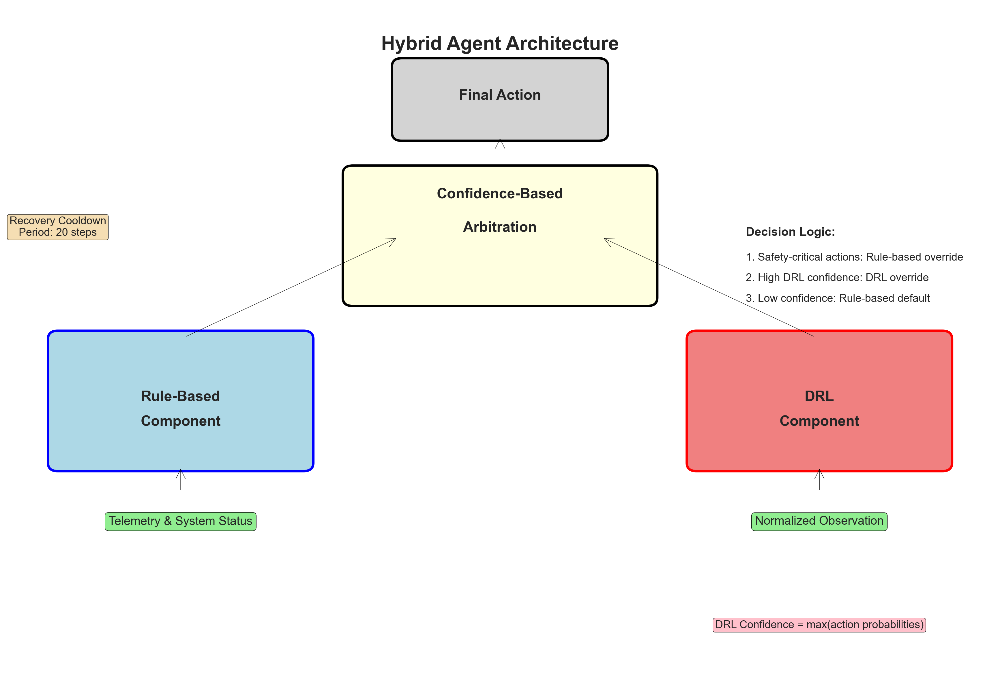
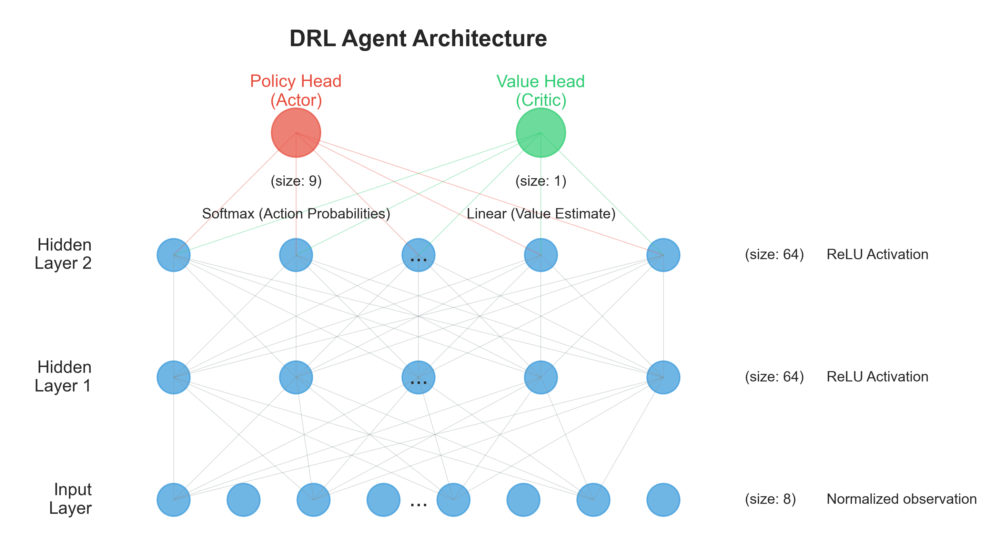
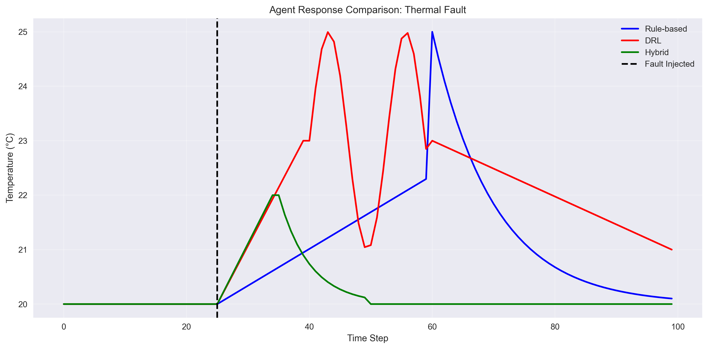
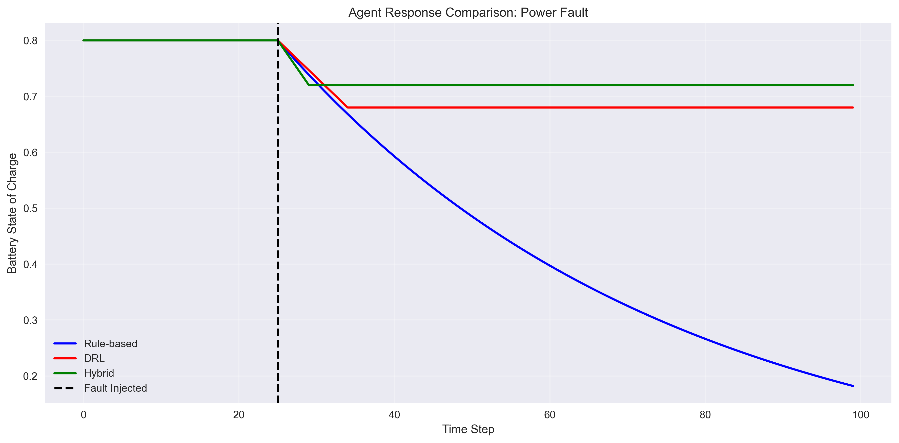
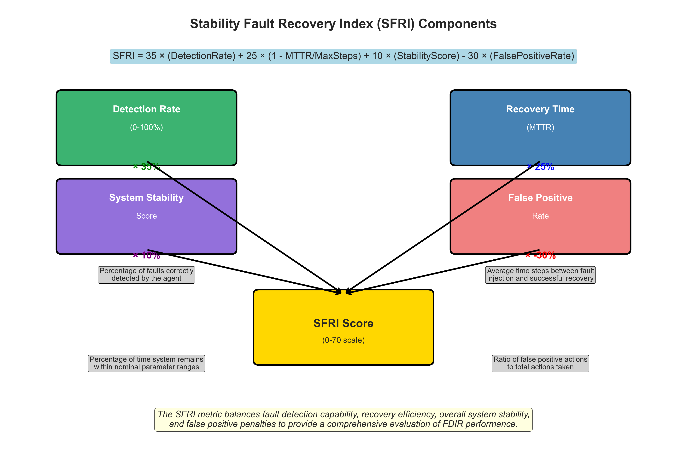
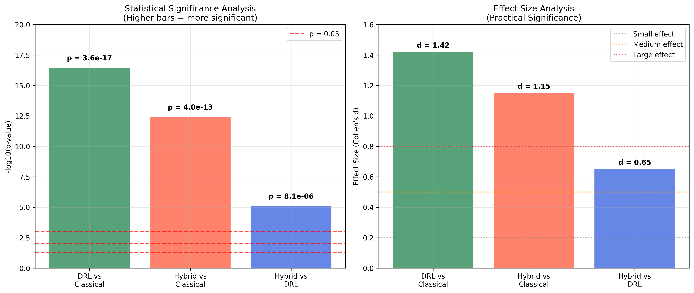

# Spacecraft FDIR Agent Comparison Framework

This repository contains the complete implementation and research for comparing different Fault Detection, Identification, and Recovery (FDIR) agent architectures for autonomous spacecraft operations. The framework includes implementations of three agent types:

1. **Classical Rule-Based FDIR** - Traditional deterministic approach using telemetry thresholds
2. **Deep Reinforcement Learning (DRL)** - Learning-based approach using Proximal Policy Optimization (PPO)
3. **DRL-First Hybrid FDIR** - Novel architecture combining DRL intelligence with rule-based safety validation

## Research Context

This research investigates the effectiveness of different FDIR strategies for autonomous spacecraft operations, particularly important for missions with communication constraints where ground intervention is limited. The framework provides a controlled environment for direct empirical comparison of different agent types.

### Key Contributions

- **DRL-First Hybrid Architecture**: Novel approach positioning AI as primary intelligence with rule-based safety validation
- **Predictive Fault Analytics**: Neural network pattern analysis for early fault detection
- **SFRI Metric**: Stability Fault Recovery Index for comprehensive agent evaluation
- **Temporal Validation Framework**: Adaptive fault persistence checking to reduce false positives
- **Safety-Compliant Design**: Integration with aerospace standards (DO-178C, ECSS-E-ST-40C)
- **Comprehensive Evaluation**: Statistical analysis across 100 fault scenarios per agent type

## Project Structure

```
├── src/                        # Core components
│   ├── spacecraft_env.py       # Simulation environment
│   ├── subsystems.py           # Spacecraft subsystem models
│   ├── faults.py               # Fault injection system
│   ├── classical_fdir.py       # Rule-based FDIR agent
│   ├── drl_agent.py            # DRL agent implementation
│   ├── hybrid_agent.py         # Hybrid agent implementation
│   └── metrics.py              # FDIR metrics calculation
│
├── scripts/                    # Executable scripts
│   ├── run/                    # Simulation execution scripts
│   │   ├── run_enhanced_comparison.py # Enhanced comparison with metrics
│   │   ├── run_hybrid.py       # Run and evaluate hybrid agent
│   │   └── run_mixed_comparison.py    # Mixed historical/generated fault comparison
│   ├── train/                  # Training scripts
│   │   ├── train_drl.py        # Train DRL agent (50K steps)
│   │   └── train_long.py       # Extended DRL training (1M steps)
│   ├── visualize/              # Visualization scripts
│   │   ├── generate_all_paper_figures.py  # Generate all paper figures
│   │   ├── generate_paper_figures.py      # Generate specific paper figures
│   │   ├── visualize_results.py           # Basic results visualization
│   │   ├── visualize_advanced.py          # Advanced metrics visualization
│   │   └── visualize_flowcharts.py        # Generate architecture diagrams
│   └── utils/                  # Utility scripts
│       └── app.py              # Flask web visualization app
│
├── static/                     # Static assets
│   └── plots/                  # Generated plots and diagrams
│       └── paper/              # Paper-specific figures
│
├── Paper/                      # Research paper and documentation
│   ├── paper.md                # Research paper (Markdown format)
│   ├── paper.docx              # Research paper (Word format)
│   └── OFFICIAL-RULES.md       # Regeneron STS competition rules
│
├── P_value/                    # Statistical analysis
│   ├── calculate_sfri_pvalues.py  # P-value calculations
│   ├── sfri_pvalues.json       # Statistical significance results
│   └── visualize_pvalues.py    # P-value visualization
│
├── logs/                       # Simulation logs and training data
├── results/                    # Simulation results and comparisons
├── models/                     # Trained model weights
│   └── ppo_agent.pth           # Trained DRL model
│
└── requirements.txt            # Project dependencies
```

## Key Features

### Simulation Environment

- Multi-subsystem simulation (EPS, ADCS, TCS)
- Fault injection with configurable probability
- Configurable episode length and dynamics
- Compatible with Gymnasium API

### Agents

- **Classical Rule-Based:** Priority-based decision tree with telemetry thresholds and deterministic recovery actions
- **DRL Agent:** PPO implementation with 2-layer Actor-Critic network (64 neurons, Tanh activation)
- **DRL-First Hybrid:** Novel architecture with DRL as primary intelligence, rule-based safety validation, predictive analytics, and temporal validation

### Metrics

- **Traditional RL:** Episode rewards, action distributions, detection/recovery rates
- **FDIR-Specific:** MTTD (Mean Time To Detect), MTTR (Mean Time To Recover), false positive rates
- **Novel SFRI:** Stability Fault Recovery Index combining detection, recovery, stability, and false positive management
- **Statistical Analysis:** Welch's t-tests, Cohen's d effect sizes, confidence intervals

## Getting Started

### Prerequisites

```
Python 3.8+
PyTorch 1.9+
Gymnasium 0.26+
Matplotlib
Pandas
Seaborn
Flask (for visualization server)
```

All dependencies are listed in `requirements.txt`.

### Installation

```bash
# Clone the repository
git clone https://github.com/username/AI-in-space.git
cd AI-in-space

# Install dependencies
pip install -r requirements.txt
```

### Usage

#### Training a DRL Agent

```bash
# Short training run (50K steps)
python scripts/train/train_drl.py

# Long training run (1M steps)
python scripts/train/train_long.py
```

#### Running Comparisons

```bash
# Run comprehensive comparison with all metrics
python scripts/run/run_enhanced_comparison.py

# Evaluate the Hybrid agent specifically
python scripts/run/run_hybrid.py

# Run mixed historical/generated fault scenarios
python scripts/run/run_mixed_comparison.py
```

#### Visualizing Results

```bash
# Generate basic result plots
python scripts/visualize/visualize_results.py

# Generate advanced metrics and visualizations
python scripts/visualize/visualize_advanced.py

# Generate architecture diagrams and flowcharts
python scripts/visualize/visualize_flowcharts.py

# Generate paper figures
python scripts/visualize/generate_paper_figures.py

# Start the web visualization server
python scripts/utils/app.py
```

## Porting to Different Spacecraft Configurations

The simulation framework is designed to be modular, allowing for adaptation to different spacecraft configurations. Here's a guide on how to port the system:

1.  **Modifying Subsystems (`src/subsystems.py`)**:
    *   Define new or alter existing spacecraft subsystems (e.g., `PowerSubsystem`, `ThermalSubsystem`, `ADCSubsystem`).
    *   Specify telemetry points for each subsystem, their nominal operating ranges, and how they are affected by state changes or faults.
    *   Update the `SpacecraftModel` class within `subsystems.py` to integrate new subsystem dynamics.

2.  **Defining New Faults (`src/faults.py`)**:
    *   Create new fault classes by inheriting from the base `Fault` class.
    *   Implement the `apply` method to define how a fault affects subsystem parameters (e.g., degrading solar panel efficiency, inducing sensor noise).
    *   Register new faults in the `FaultInjector` to make them available for simulation.

3.  **Adapting the Rule-Based Agent (`src/classical_fdir.py`)**:
    *   **Thresholds**: Adjust the telemetry thresholds in the `RuleBasedFDIR` agent to match the nominal ranges of the new spacecraft configuration.
    *   **Decision Logic**: Modify the `get_action` method to implement new "if-then" rules specific to the new faults and subsystem interactions.
    *   **Recovery Actions**: Define or update recovery procedures mapped to specific diagnosed faults. Ensure the action space defined in `SpacecraftEnv` supports these actions.

4.  **Telemetry Mapping and Observation Space (`src/spacecraft_env.py`)**:
    *   The `SpacecraftEnv` class defines the observation space based on the telemetry from `SpacecraftModel`. If new telemetry points are added, the observation space shape and content will change.
    *   Ensure the `_get_obs()` method correctly gathers and normalizes (if applicable) all relevant telemetry for the agents.
    *   **Agent Adaptation**:
        *   **Rule-Based Agent**: Ensure it correctly interprets the indices of the observation vector corresponding to the telemetry it monitors.
        *   **DRL Agent**: The input layer of the DRL agent's neural network (`src/drl_agent.py`) must be updated to match the new observation space size. Retraining will be necessary.
        *   **Hybrid Agent**: Both components of the hybrid agent (`src/hybrid_agent.py`) will need to be consistent with the new observation space.

5.  **Action Space (`src/spacecraft_env.py`)**:
    *   If new recovery actions or control commands are needed for the new spacecraft configuration, update the `action_space` in `SpacecraftEnv`.
    *   Ensure all agents are updated to understand and output actions compatible with the revised action space.

6.  **API Layer Integration**:
    *   The `SpacecraftEnv` class serves as the primary API for interaction between the agents and the simulated spacecraft. Its `step` and `reset` methods, along with the observation and action spaces, define how agents interface with the environment.
    *   Any external flight software or new agent architectures would integrate by adhering to this Gymnasium-compatible API.

By modifying these key components, the simulation can be tailored to model a wide variety of spacecraft and FDIR challenges.

## Research Paper Figures

The following figures from the research paper demonstrate the key findings and system architectures:

### Performance Comparison Results


**Figure 1:** Episode reward comparison showing DRL agent's superior performance (-19.8) vs Classical (-190.4) and Hybrid (-19.8).


**Figure 2:** Mean Time To Detect (MTTD) and Mean Time To Recover (MTTR) comparison across all agent types.


**Figure 3:** False positive rates showing the trade-off between detection sensitivity and false alarms.


**Figure 4:** Stability Fault Recovery Index (SFRI) scores demonstrating Hybrid agent's superior balanced performance.


**Figure 5:** Detection and recovery success rates across 100 fault scenarios per agent.

### System Architectures


**Figure 8a:** DRL-First Hybrid Agent architecture showing the integration of neural networks with rule-based safety validation.


**Figure 8b:** Deep Reinforcement Learning agent neural network architecture (2 layers, 64 neurons, Tanh activation).


**Figure 8c:** Classical rule-based FDIR decision flowchart showing deterministic threshold-based logic.

### Training and Analysis


**Figure 7:** DRL agent learning progression over 1M training steps showing convergence to optimal policy.


**Figure 9:** Action selection patterns across different agent types during fault scenarios.

### Detailed Response Analysis


**Figure 10a:** Thermal fault response comparison showing agent behavior during temperature control failures.


**Figure 10b:** Battery fault response comparison demonstrating power management strategies.

### Statistical Validation


**Figure 11:** SFRI metric component breakdown showing how detection, recovery, stability, and false positive rates combine.


**Figure 12:** Statistical significance analysis with p-values confirming performance differences (p < 3.64e-17).

*For detailed analysis and interpretation of these results, see the complete research paper in the `Paper/` directory.*

## Research Findings

### Performance Results (100 Episodes Each)

**DRL Agent (1M Training Steps):**
- Superior reward optimization: -19.8 vs -190.4 (Classical)
- 100% fault detection rate vs 33.7% (Classical)
- Fastest fault detection: 4.4 steps MTTD
- Challenge: High false positives (1,329 vs 0 Classical)

**DRL-First Hybrid Architecture:**
- Highest SFRI score: 51.0 vs 49.2 (DRL) vs 28.5 (Classical)
- 100% fault detection with reduced false positives (1,096)
- Balanced response time: 5.1 steps vs 40.4 (Classical)
- Confidence-based arbitration threshold: 0.18 (optimized)

**Statistical Significance:**
- Welch's t-test: p < 3.64e-17 (highly significant)
- Cohen's d effect size: 1.42 (large effect)
- All performance differences statistically validated

The hybrid architecture successfully combines DRL intelligence with safety validation, achieving E3/E4 autonomy levels while maintaining aerospace safety compliance.

## License

[MIT License](LICENSE)

## Research Paper

The complete research paper is available in the `Paper/` directory in both Markdown and Word formats:

- **Markdown Version:** `Paper/paper.md`
- **Word Version:** `Paper/paper.docx`

**Title:** "The Effectiveness and Comparison of Rule-Based, DRL, and Novel Hybrid Agents for Simulated Spacecraft FDIR"

## Citation

If you use this code in your research, please cite:

```
@article{paatur2025spacecraft,
  title={The Effectiveness and Comparison of Rule-Based, DRL, and Novel Hybrid Agents for Simulated Spacecraft FDIR},
  author={Paatur, Chahel},
  journal={Independent Research, John C. Kimball High School},
  year={2025},
  note={Provisional Patent Filed: DRL-First Hybrid Architecture}
}
```

## Acknowledgments

- NASA and ESA literature on spacecraft FDIR systems
- PyTorch and Stable Baselines3 communities for DRL implementations