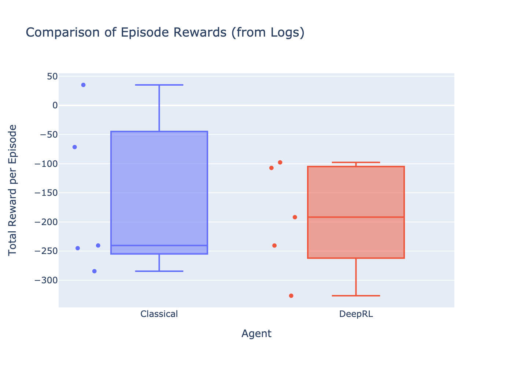
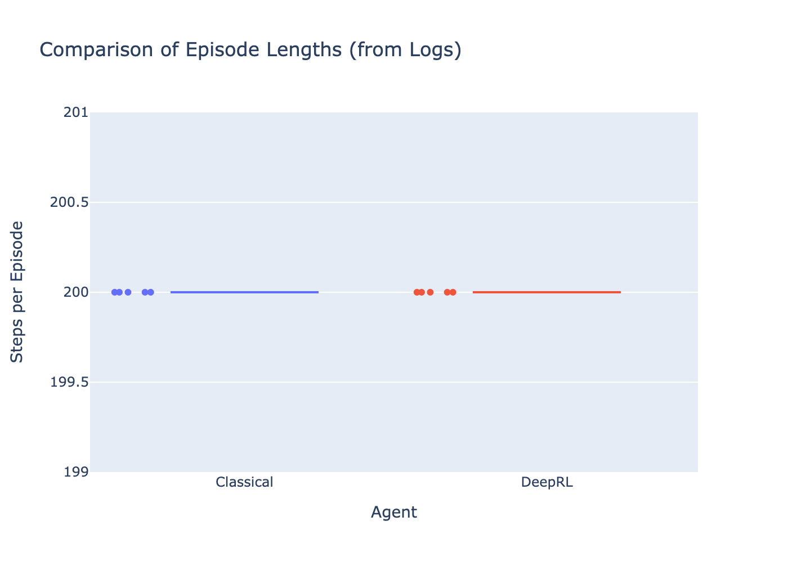
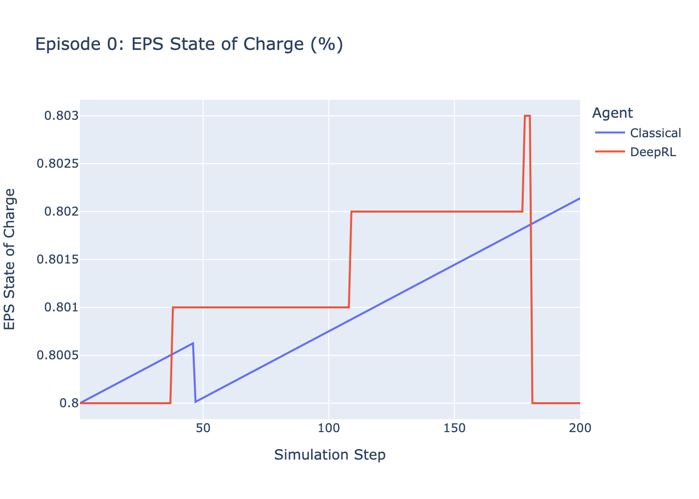
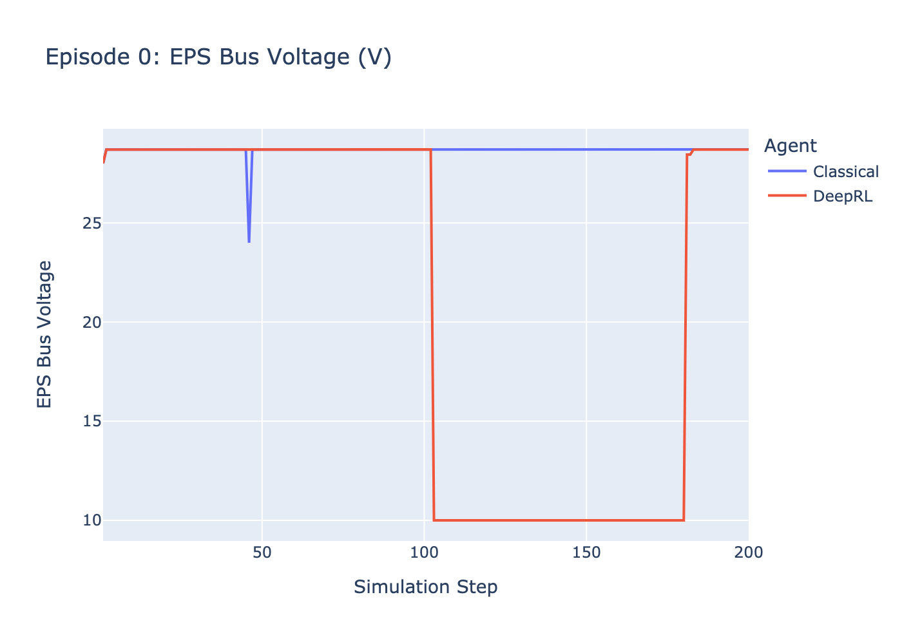
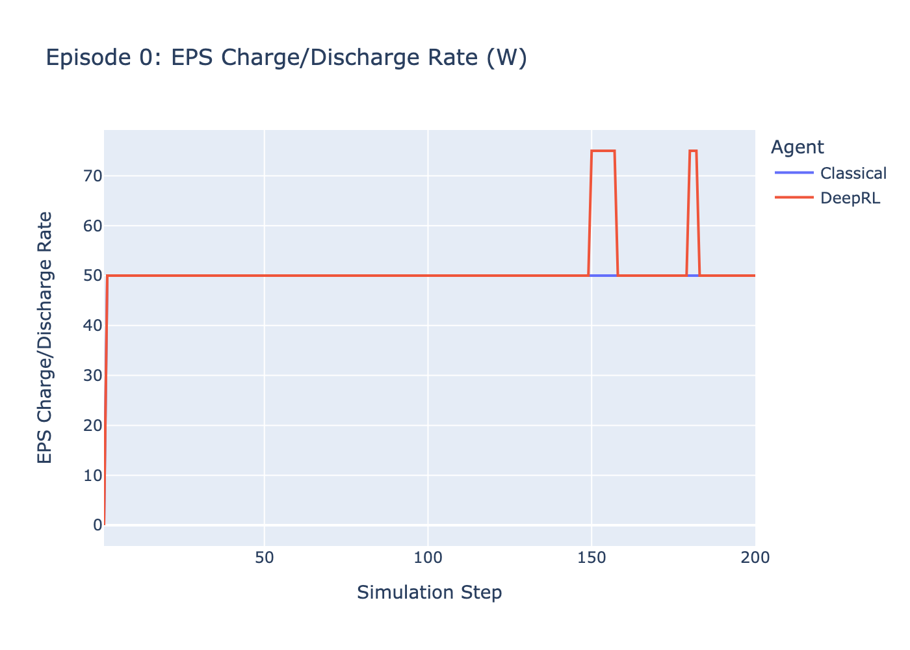
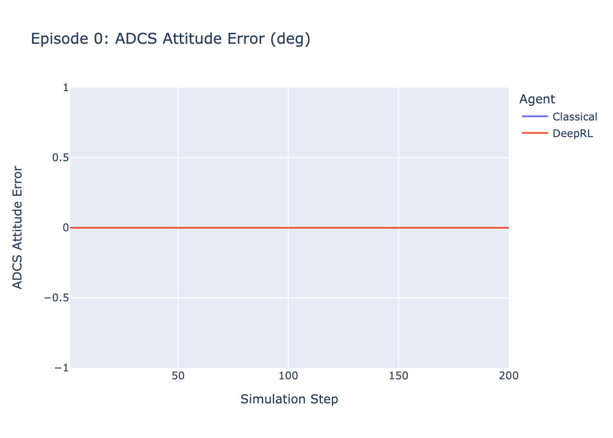
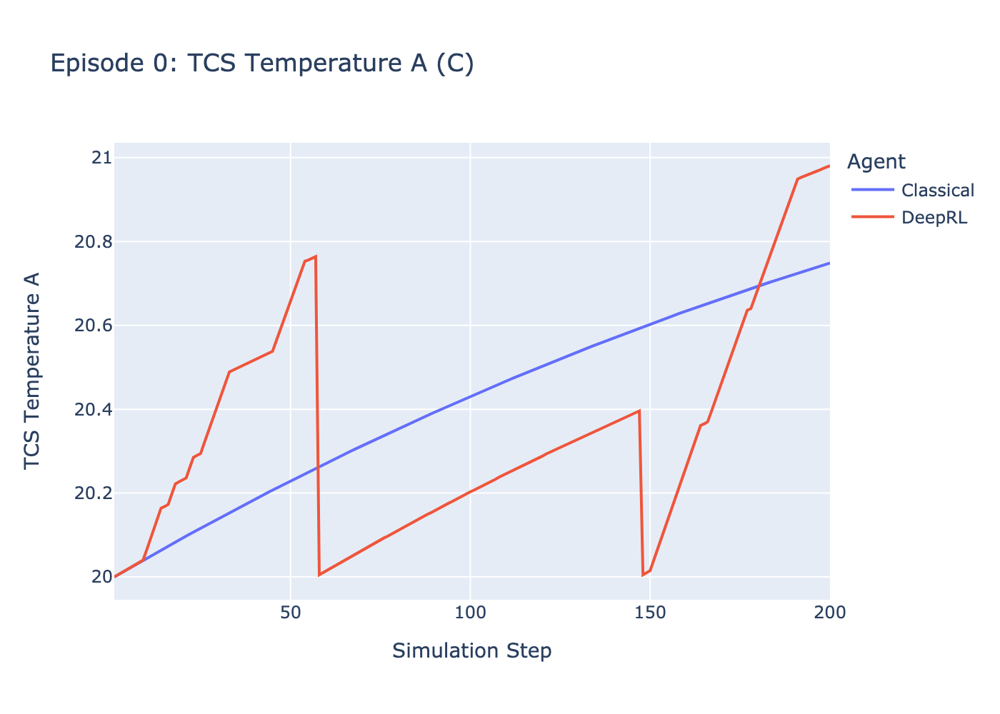
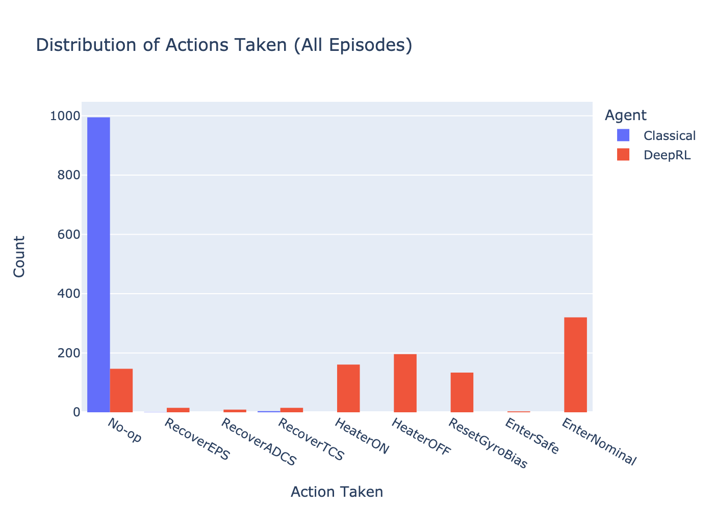

# Simulation Results Visualization Report

### Comparison of Episode Rewards (Box Plot)
*   **What it shows:** Compares the distribution of the *total reward accumulated* in each full episode for the Classical agent vs. the DRL agent.
*   **Analysis:** Look at the median (line inside the box), the spread (box height/IQR), and outliers (dots). This helps compare typical performance, consistency, and best/worst-case scenarios between the agents.

### Comparison of Episode Lengths (Box Plot)
*   **What it shows:** Compares the distribution of the *total number of steps* (duration) each agent lasted per episode.
*   **Analysis:** Indicates agent longevity or survival time. Higher values are generally better, unless hitting a fixed maximum step limit. Compare median duration and variability.

#### Episode 0: EPS State of Charge (%)

#### Episode 0: EPS Bus Voltage (V)

#### Episode 0: EPS Charge/Discharge Rate (W)

#### Episode 0: ADCS Attitude Error (deg)

#### Episode 0: TCS Temperature A (C)

### Action Distribution (Histogram)
*   **What it shows:** Aggregates data *across all episodes* to show how frequently each discrete action was chosen by the Classical vs. the DRL agent.
*   **Analysis:** Reveals the overall control *strategy* or *policy*. Compare action preferences, frequency of recovery actions, or actions uniquely used by one agent.

---
*Report generated automatically.*